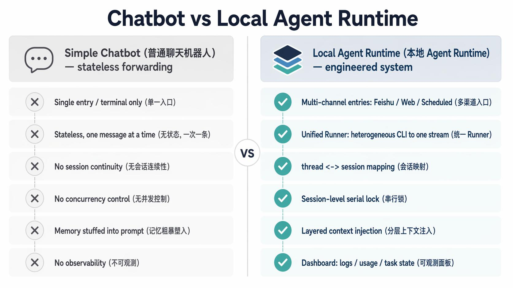
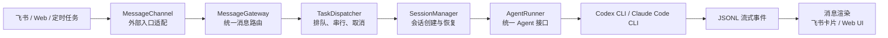
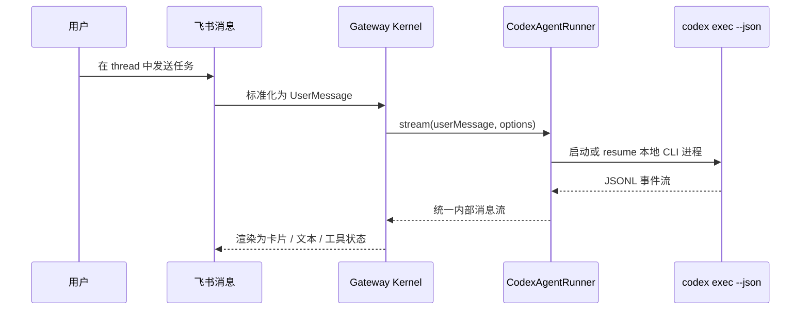
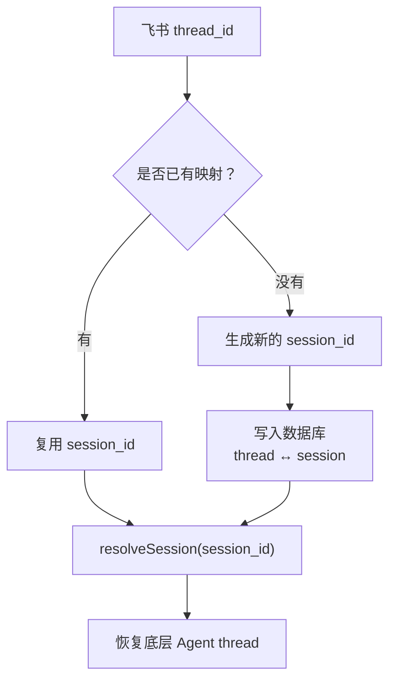
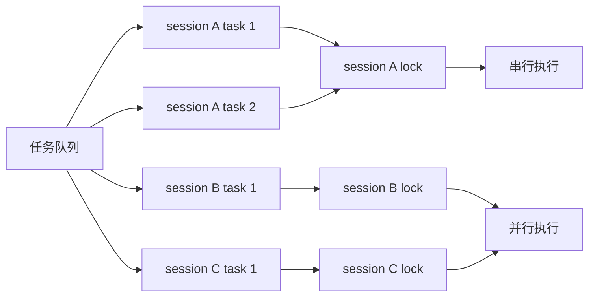
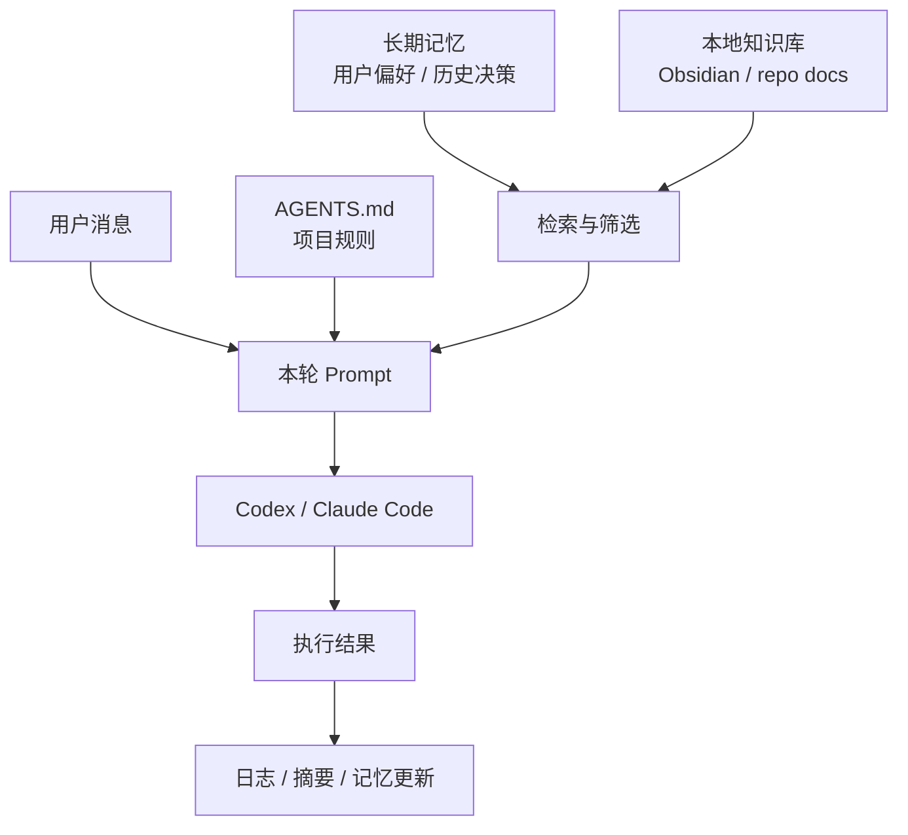
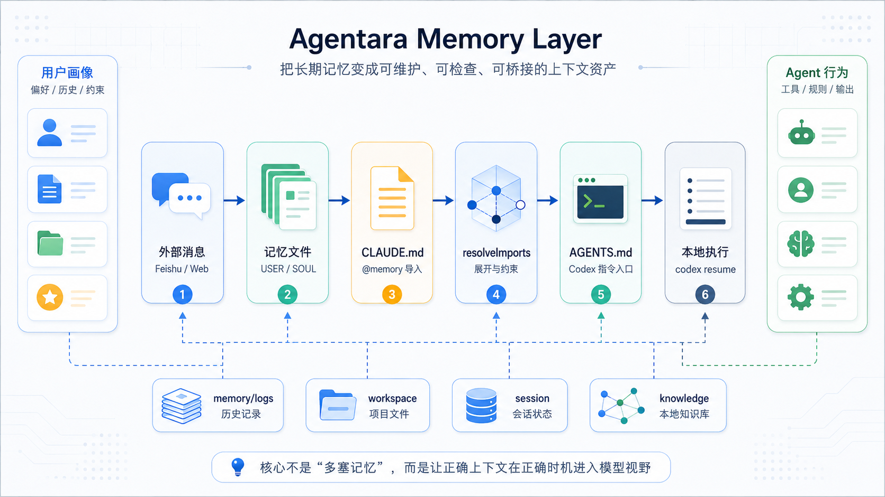

# 从 CLI Agent 到本地 Agent Runtime：一套包装本地 Agent 的工程模式

## 文档目标

- 解释 Codex / Claude Code 这类 CLI Agent 如何从“终端里的命令”变成“工作流里的 Runtime”
- 用 Agentara 作为具体例子，拆解包装本地 Agent 需要补齐的运行时抽象、记忆机制和安全边界
- 总结这套模式在个人知识库、团队协作和仓库维护场景中的可迁移原则

## 文档受众

- 已经使用过 Codex、Claude Code 或类似 Coding Agent 的开发者
- 想把本地 Agent 接入飞书、Web、定时任务或知识库工作流的同学
- 希望理解 Agentara 这类项目工程本质，而不是只看安装和配置步骤的读者


## 0. Insight

- **本地 Agent 的难点不只在模型**
  真正决定它能否进入真实工作流的，是模型外面的消息通道、会话系统、任务队列、记忆注入和可观测 UI
- **包装层的本质是 Agent Gateway**
  不替代 Codex / Claude Code 等的执行能力，
  而是把这些 Agent 包装成可交互、可持续、可拓展的本地 Agent Runtime
- **核心结构可以拆成两部分**
  运行时侧由统一 Runner、thread ↔ session 映射、session 级串行锁、分层上下文注入支撑；
  长期可用性还依赖可维护的 memory layer
- **记忆机制不是简单堆 prompt**
  更关键的是把 USER、SOUL、项目规则、历史记录和本轮任务拆清楚，
  让正确上下文在正确时机进入模型视野
- **该模式下的明确边界**
  一旦远程消息能触发本地执行，
  权限、目录、审批、日志、记忆更新和可撤销性就必须先于功能扩展被设计清楚
- **比起造一个更强的 Agent，更现实的是借力**
  模型和 AI CLI 等仍在高速迭代，工程侧真正的价值在于把这些能力接入稳定工作流

本文会用开源项目 Agentara 作为贯穿全文的例子。

> Agentara 开源地址（作者 Henry Li 大佬）：https://github.com/MagicCube/agentara（强烈安利⭐️）：
>
> Your 24/7 personal assistant powered by Claude Code and OpenAI Codex. Multi-channel messaging, long-term memory, skills, task scheduling, session management, and more — all running locally.

这里不展开 Agentara 的安装与配置，而是借这个项目回答一个更通用的问题：

**一个本地 CLI Agent，需要补上哪几层运行时工程和记忆机制，才能从终端命令变成可持续的工作流 Runtime。**

## 现象：为什么大家都在“包装”本地 Agent

过去我们使用 AI Agent 的主要入口是终端或 IDE。

打开 Codex，输入任务，等它读代码、改文件、跑命令。这个形态直接、高效，但边界也很明显：

- 交互入口被锁在本地终端
- 长任务状态难以被外部系统感知
- 团队协作入口，比如飞书等，很难直接接上
- 记忆、知识库、定时任务、外部触发器，需要额外系统承载
- 多会话、多任务、取消、恢复、日志、用量展示，通常不会由 CLI 自己完整处理

于是越来越多工具开始做同一类事情：

它们不自己训练模型，而是把**已经存在的 CLI Agent 当作底层执行引擎，在外面包一层交互与编排系统**。

Agentara 就是这条路线上一个相当完整的例子。

> CLI Agent 正在从“命令行工具”，变成一种“本地 Agent Runtime”。

普通聊天机器人和本地 Agent Runtime 的差异，可以先用这张图压缩理解：



> 普通聊天机器人更像无状态消息转发；
>
> 本地 Agent Runtime 则是一套围绕多入口、会话、任务、上下文和可观测性搭起来的工程系统。

那么要完成这层“包装”，工程上到底需要补齐什么？

接下来先用一个 Agent Gateway 流程图看整体链路，再把运行时抽象和记忆链路分开拆解。

## 全貌：包装层的本质是一个 Agent Gateway

无论用什么技术栈实现，这类包装层的工程结构都高度相似。它本质上是一个 Agent Gateway：



这个 Gateway 流程图里最关键的不是某个具体模块，而是它做的一件事：

- **把“外部交互”和“本地 Agent 执行”隔离开**

外部系统不必知道 Codex 怎么 resume，也不必理解 Claude Code 的 stream-json 格式。而反过来，底层 Agent 也不必知道消息来自飞书、网页还是定时任务。所以夹在中间的 Gateway，负责协议转换、会话映射、任务调度和输出渲染。这也是 Gateway 的意义。**它本身不是能力，而是让能力可以被更多场景稳定调用**。

而真正撑起这个 Gateway 的，首先是四个运行时侧的核心抽象：

- 它们解决消息进入、会话延续、任务执行和上下文注入的问题
- 随后还需要单独看 memory layer 如何让长期上下文稳定沉淀


## 抽象一：统一 Runner 接口——把异构 CLI 收敛成一种消息流

第一个问题是：底层 Agent 各不相同，输出协议也各不相同：

- **Codex、Claude Code，以及未来可能接入的 Gemini CLI、Aider 或自研 Agent，都不应该把外层系统绑死**

因此包装层需要一个很小的抽象：统一 Runner 接口。

它对底层 Agent 只提出一个要求：接收用户消息，并返回一个流式消息迭代器：

```ts
interface AgentRunner {
  readonly type: string;

  stream(
    userMessage: UserMessage,
    options: AgentRunOptions,
  ): AsyncIterableIterator<SystemMessage | AssistantMessage | ToolMessage>;
}
```

这个抽象很小，但它把包装层和具体 Agent 实现解耦了，比如：

| Runner 类型 | 底层执行方式 | 输出协议 | Runner 负责的事情 |
| --- | --- | --- | --- |
| Claude Code | claude --print --output-format stream-json | stream-json | 解析 system、assistant、tool_result 等事件 |
| Codex | codex exec --json | JSONL events | 解析 thread、message、command、file_change、mcp_tool_call 等事件 |

这里有一个容易误解的点：

- **Agentara 没有把 Codex 伪装成标准 OpenAI Chat API**

它做的是更工程化的事情：把不同 CLI Agent 的异构流式事件，映射成统一的内部消息类型。

这层映射看起来只是适配代码，实则是整个系统能否扩展的关键。

只要实现新的 Runner，外层的飞书入口、任务队列、Web UI 和日志系统都可以继续复用。

落到 Codex 上，runner 会启动本地子进程：

```bash
codex exec --model <model> --json --skip-git-repo-check <prompt>
```

已有会话则通过 resume 进入同一个底层 thread：

```bash
codex exec --model <model> --json resume <thread_id> <prompt>
```

随后读取 stdout 中的 JSONL 事件，逐条转成内部消息：



这里有三个通用要点，适用于任何 CLI Agent 的包装：

- **CLI 始终是执行主体**：读仓库、调工具、跑命令、改文件的是底层 Agent，包装层只负责调用与转译
- **结构化输出是命门**：没有 --json，外层无法稳定区分最终回答、命令执行、文件修改、工具调用和错误
- **resume 能力决定多轮是否成立**：没有稳定 resume，外部入口里的连续回复就很难对齐到底层 Agent thread

## 抽象二：thread ↔ session 映射——多入口系统的上下文连续性

一旦交互入口从终端搬到飞书话题，就会出现一个终端里并不明显的问题。即：

下一条飞书回复，应该进入哪个 Agent 会话？

终端窗口天然就是一个上下文。但飞书是多话题、多人、异步的，消息流本身不携带“我属于哪个任务”的信息。

所以系统**必须显式维护 thread 到 session 的映射：**



这个设计看起来朴素，但它解决的是多入口 Agent 系统里最容易翻车的问题：**上下文连续性**。

没有这层映射，飞书只是一条消息流。而有了它，一个 thread 才真正变成一个能被 Agent 持续理解的任务容器。

这也是 Agent Runtime 和简单 webhook 转发的本质区别：

- 简单转发只处理“这一条消息”
- 会话映射处理“这一串消息属于同一个任务”
- session 再继续对齐到底层 Agent 的 thread

## 抽象三：session 级串行锁——有状态 Agent 的并发控制

本地 Agent 不是普通的无状态 API。一次 Codex 运行可能会读文件、改文件、跑命令、写入自己的 session 状态。

如果同一个 session 里同时进来两条消息，让两个子进程并发跑，就可能出现几个问题：

- 两轮对话同时 resume 同一个 thread
- 同一个仓库被两个任务同时修改
- 后发的消息先完成，先发的消息反而后完成
- 用户看到的飞书回复顺序错乱
- /stop 不知道该停哪一个任务

所以这类系统的任务调度必须遵循一条核心策略：

- **同一 session 内串行执行，不同 session 之间可以并行执行**

实现上通常是按 session_id 维护一把锁，或者维护一个串行队列。

同一 session 的任务排队执行，锁释放后才取下一个；不同 session 各持各的锁，互不阻塞。

换句话说，**串行锁锁的是“同一 session 的任务队列”，不是“子进程”本身**。



> 所以我理解这也正是从聊天机器人走向 Agent Runtime 必须补上的那层工程。

模型聪不聪明只是一个维度：

而能不能长期稳定运行，更取决于任务状态、并发控制、取消恢复和错误处理是否扎实。

## 抽象四：分层上下文注入——是调度记忆，而不是堆砌记忆

第四个运行时抽象，关于上下文和记忆。

其中“记忆系统”拆到工程的实现里，更像是一个上下文调度问题。

所以这里我们先关注“本轮上下文如何进入模型”的问题，后面再展开记忆机制本身的设计介绍。

| 上下文来源 | 适合承载什么 | 需要注意什么 |
| --- | --- | --- |
| AGENTS.md / CLAUDE.md | 项目级稳定规则、协作约定、工具使用边界 | 优先级通常应高于个人长期记忆 |
| 本轮 prompt | 当前任务、用户最新意图、临时约束 | 只保留和这轮任务直接相关的信息 |
| MCP resource / tool | 按需读取的外部知识、API、数据源 | 需要明确权限和调用时机 |
| 本地知识库 / repo docs | 长期沉淀的项目知识、个人笔记、历史决策 | 需要检索和筛选，不能无差别注入 |
| session summary | 长会话压缩后的历史状态 | 摘要需要可被纠错，避免把旧结论固化 |



这也解释了为什么记忆不能粗暴地全塞进去。上下文不是越多越好，它至少会带来三类风险：

- **污染风险**：旧规则覆盖当前项目规则
- **预算风险**：无关信息挤占真正重要的上下文
- **权限风险**：远程消息可能诱导 Agent 读取或发送不该碰的信息

所以更成熟的做法不是“有记忆就注入”，而是先做判断：

- 比如这条记忆与当前任务是否相关、是否仍然有效、是否应该覆盖项目原生规则等等

一句话，**上下文工程不是堆消息，而是设计信息在正确时机进入模型视野的方式**。

## Agentara 的记忆机制：把长期记忆变成可控的上下文资产

这里值得单独来说明下 Agentara 的记忆机制：

- **它好的地方不在于做了一个复杂的“记忆大脑”，而在于把记忆放进了一条很清晰的工程链路里**

当前源码里可以看到，它把长期记忆拆成三类上下文资产：

| 记忆文件 | 承载内容 | 工程意义 |
| --- | --- | --- |
| memory/USER.md | 用户偏好、持续上下文、重要历史 | 让 Agent 记住“服务的是谁”以及长期协作方式 |
| memory/SOUL.md | Agent 身份、原则、能力边界 | 让 Agent 记住“自己是谁”以及该如何工作 |
| memory/logs/\*.md | 日常对话或执行记录 | 为后续记忆更新和历史回看提供材料 |

这几个文件不是孤立存在的。Agentara 的默认 CLAUDE.md 会通过静态导入，把它们接进启动指令里：

```md
@memory/SOUL.md
@memory/USER.md
```

随后，指令解析逻辑会展开这些 @path/file 导入。

如果路径试图逃出基础目录，会被拒绝；如果文件不存在，会留下明确的占位提示，而不是静默失败。

> 同样的还有针对 Codex 侧的适配，因为 Codex 原生读取的是 AGENTS.md，
>
> 所以 Agentara 会在每次 Codex runner 执行前，把展开后的 CLAUDE.md 同步成 AGENTS.md。



这种机制设计的好处可以看到有以下几点：

- **记忆是文件化的**：可以被查看、编辑、审阅和版本化，而不是藏在不可见的 prompt 拼接里
- **记忆是分层的**：USER、SOUL、项目规则和本轮 prompt 各自承担不同职责
- **记忆是可桥接的**：同一份 CLAUDE.md 能通过同步适配到 Codex 的 AGENTS.md
- **记忆是可约束的**：导入解析会限制路径逃逸，避免把任意本地文件都变成上下文

这也是我觉得 Agentara 记忆机制值得学习的地方。当然这类设计也不是 Agentara 的孤立选择。

从当前的演进看 Codex 和 Claude Code 都在把“长期指令 / 自动记忆 / 项目规则 / 技能或工具”拆成不同层级。

区别在于，Agentara 把这些上下文资产进一步接到了飞书、Web Dashboard 和本地 CLI 执行链路里，让记忆不只服务于一次 CLI 会话，而是服务于一个长期运行的 Agent Runtime。

| 工具 | 原生上下文机制 | 对 Agentara 的启发 |
| --- | --- | --- |
| Codex | 通过 AGENTS.md 读取全局、项目和目录级指令；Memories 用于保存稳定偏好、工作流和项目约定 | 稳定规则、个人偏好和跨线程记忆需要分层；强规则仍应放在 AGENTS.md 或项目文档中 |
| Claude Code | CLAUDE.md 承载持久指令；Auto memory 根据修正、偏好和工作模式自动沉淀上下文 | 记忆需要可读、可审计、可分层；同时要承认它是上下文，不是强制执行层 |
| Agentara | USER / SOUL 记忆文件、@memory 导入、CLAUDE.md 到 AGENTS.md 的桥接 | 把 CLI 的上下文机制上升为 runtime 级能力，并让飞书、Web 和本地执行共用同一套记忆底座 |

这说明我们不是在凭空给 Agentara 赋予一个概念，而是在观察一个更普遍的趋势：

- 本地 Agent 的长期能力，**越来越依赖可维护的上下文资产，而不是一次性 prompt**

它没有把记忆包装成一个玄学概念，而是把记忆变成可维护、可检查、可迁移的上下文资产。

当然，**这套机制也有边界**：它更偏向“稳定记忆文件 + 指令导入”，不是完整的语义检索系统。如果要扩展到更大的个人知识库或团队知识库，还需要继续补检索、排序、过期判断和权限过滤，但也正因为它足够朴素，才适合作为本地 Agent Runtime 的记忆底座。

当然这里还有一个关键点没有提到：**记忆不只是被加载，也需要被更新**。

Agentara 会把 session 消息写入 session jsonl，同时把纯文本对话按天追加到 memory/logs/YYYY-MM-DD.md。这些日志并不直接等于长期记忆，而是长期记忆更新的原始材料。

默认 CLAUDE.md 里也定义了 Session End Protocol：在会话结束前，如果出现了新的稳定偏好、重要上下文或需要清理的过期信息，Agent 应该更新 memory/USER.md 和 memory/SOUL.md。Web Dashboard 的 Memory 页面也提供了人工编辑入口。

所以这套记忆机制更像是“可审阅的半自动记忆维护”：日志负责保留事实材料，Agent 或用户负责把其中稳定、重要、可复用的信息提炼进 USER/SOUL，下一次会话再通过 CLAUDE.md / AGENTS.md 注入运行时。

## 把这些抽象拼起来：能力的拓展空间

当我们实现了统一 Runner、会话映射、串行锁、分层上下文和 memory layer 等一旦补齐，那么本地 Agent 就不再只是一个会回答的模型，而是会成为一个可以被系统调用、被用户协作、被长期维护的 Runtime：

| 可拓展方向 | 具体形态 | 背后复用的能力 |
| --- | --- | --- |
| 多渠道入口 | 飞书、Slack、Telegram、邮件、网页控制台 | MessageChannel / MessageGateway |
| 长期任务 | 定时总结、PR 监控、知识库整理、日报生成 | TaskDispatcher / Scheduler |
| 个人知识助理 | Codex + Obsidian + 本地记忆 | 分层上下文注入 / memory files |
| 仓库维护助手 | 自动读 repo、生成 issue、检查 PR、补测试 | 统一 Runner / workspace |
| 团队协作 Agent | 群聊里创建任务、跟进状态、同步结论 | 会话映射 / 流式渲染 |
| 可观测面板 | session、usage、日志、任务状态、工具调用 | Web Dashboard / 本地数据库 |

真正具备迁移价值的，不是某两个核心文件，也不是某一段代码，而是这里关键的一组工程问题：

1. 外部事件如何变成标准的内部消息
2. 一条消息如何找到正确的会话
3. 一个会话如何恢复到底层 Agent thread
4. 同一会话里的多个任务如何串行
5. Agent 的工具调用和文件修改如何渲染给用户
6. 长期记忆如何沉淀、审阅、注入，又不污染上下文
7. 失败、取消、重试、日志和用量如何对用户可见

## 边界和风险

当然这套模式也存在边界和风险，因为它连接的是远程消息入口和本地执行环境，风险天然比普通聊天机器人高：

| 风险点 | 典型场景 | 影响 | 处理建议 |
| --- | --- | --- | --- |
| 远程消息触发本地命令 | 飞书、Slack、Web 消息直接触发 Codex 执行 | 可能访问本地文件、修改仓库、执行危险命令 | 明确运行目录、权限范围、审批策略和日志记录 |
| CLI 协议不是稳定 API | 依赖 codex exec --json 或 claude --output-format stream-json 解析事件 | CLI 输出字段变化会影响 Runner 适配 | 用测试覆盖 assistant message、command execution、file change、MCP tool call、error、session started、resume |
| 记忆注入覆盖项目规则 | 长期记忆、个人偏好、项目规则同时进入上下文 | 旧规则可能污染当前项目判断 | 采用“检索 → 筛选 → 注入”，让项目原生规则保持更高优先级 |
| 记忆更新误写 | 把一次性偏好、临时情绪或过期规则写入 USER.md | 后续 session 持续被错误上下文影响 | 将日志、候选记忆和最终记忆分层；重要记忆更新最好可审阅、可回滚 |

**这里尤其需要注意权限问题**。如果飞书里的一句话就能触发 Codex 在本地执行命令，系统必须先回答几个问题：

- 运行目录在哪里
- 是否允许修改文件
- 是否允许执行危险命令
- 是否允许访问用户目录
- 是否允许读取密钥、token 或浏览器状态

而 Agentara 当前对 Codex 采用绕过审批和 sandbox 的执行方式，这让交互更顺滑，但也意味着它更适合个人受控环境。如果要放到团队群或更开放的入口里，**安全边界必须先于功能扩展被设计清楚**。

## 一些个人理解：拓展本地 Agent 的真正含义

最初看 Agentara，我关注的是能不能把 Codex 接到飞书。

但顺着这套模式拆下来，我最大的收获其实是一句更普适的话。

> 本地 Agent 的能力，不只由模型决定，而是由模型外面的工程系统共同决定。

模型负责推理、读代码、调工具、执行修改。包装层负责让这些能力进入真实场景：

- 飞书提供协作入口
- session 提供上下文连续性
- task queue 提供执行秩序
- Web UI 提供可见状态
- memory 提供长期上下文
- runner 把 CLI Agent 变成可流式调用的 Runtime

这让我重新理解了“拓展 Codex”的含义。它不一定是改 Codex 本身，也不一定是训练新模型。很多时候，真正有效的拓展发生在模型外部。它做的是把 Agent 接入正确的入口，喂它正确的上下文，约束它的执行边界，记录它的状态，再把结果回流到用户真正工作的地方。

以及面对快速迭代的模型和 AI CLI，工程侧到底该把力气花在哪里？、我理解更现实的方向是基于 Codex / Claude Code 这类工具做包装，而不是从零开始做一个更强的 Agent。这类 AI CLI 和背后的模型能力仍在高速迭代。模型推理、工具调用、代码理解、终端执行，以及和 IDE / CLI 的结合，都会继续被厂商投入推着往前走。对个人或小团队来说，真正现实的策略不是在这些基础能力上正面超过它们，而是把它们当成一层持续升级的底座。

| 投入方向 | 要解决的问题 |
| --- | --- |
| 接入真实协作入口 | 让 Agent 不只停留在终端，而是进入飞书、Web、定时任务等实际工作入口 |
| 分层上下文管理 | 让 Agent 拿到正确的项目规则、知识库信息和任务现场，而不是简单堆 prompt |
| 记忆机制维护 | 让长期偏好、历史决策和工作模式能被稳定沉淀，并在合适时机进入上下文 |
| 会话与任务调度 | 降低多轮对话、并发执行、长任务恢复带来的状态混乱 |
| 权限与可观测性 | 用审批、日志、任务状态和 Dashboard 控制远程触发本地执行的风险 |
| 工作场景适配 | 把通用 AI CLI 能力转成适合个人知识库、团队协作和仓库维护的工作模式 |

换句话说，AI 工程应用的价值更重要的是，把已经快速演进的 AI 能力，组织成更稳定的工作流和工作模式。

## 可迁移原则

如果要把这套经验迁移到自己的 Agent 工程实践里，我会优先记住这几条原则。

| 原则 | 核心含义 | 实践提醒 |
| --- | --- | --- |
| 先设计运行时，再设计 prompt | 长任务 Agent 不能只靠 prompt | 先想清楚任务容器、会话、状态、取消、恢复、日志和交付物分别落在哪里 |
| 把 CLI Agent 当成本地执行引擎 | Codex / Claude Code 的价值不只是回答，而是读 repo、跑命令、调工具、改文件 | 外层系统应该尊重并包装这份能力，不要把它降级成普通聊天模型 |
| 会话映射是多入口系统的地基 | 飞书 thread、Web session、定时任务、底层 Agent thread 必须能彼此对齐 | 否则系统表面能跑，实际很容易发生上下文漂移 |
| 上下文工程要分层 | 稳定规则、任务现场、长期记忆、历史摘要、本地文件不应该混成一坨 | 不同信息应在不同阶段、以不同优先级进入 Agent 视野 |
| 记忆要可维护 | 长期记忆需要能被查看、编辑、压缩、纠错和清理 | 不要把记忆藏在不可见 prompt 里，也不要让旧记忆永久覆盖新上下文 |
| 安全边界要早于功能扩展 | 远程消息一旦能触发本地执行，权限就变成基础设施 | 目录、审批、日志和可撤销性需要在功能扩展前设计清楚 |

## 结尾

绕开具体项目来看，这套模式给我最大的启发是一个更大的方向：

- 本地 CLI Agent，可以成为个人和团队工作流里的 Runtime
- 它们不必变成云端 API，也不必被重新包装成又一个聊天产品

只要外层系统能补齐统一 Runner、会话映射、任务调度、分层上下文、记忆机制和安全边界，本地 Agent 就能自然地走进更多真实工作场景。Agentara 证明了这条路走得通。更重要的是，它提醒我们：

真正值得投入的，不只是模型本身，而是模型外面的工作流、上下文和运行时。

## 参考

- MagicCube/agentara（[GitHub Repository](https://github.com/MagicCube/agentara)）
- OpenAI Codex manual（[AGENTS.md / Memories](https://developers.openai.com/codex/codex-manual.md)）
- Claude Code memory docs（[CLAUDE.md / Auto memory](https://code.claude.com/docs/en/memory)）
