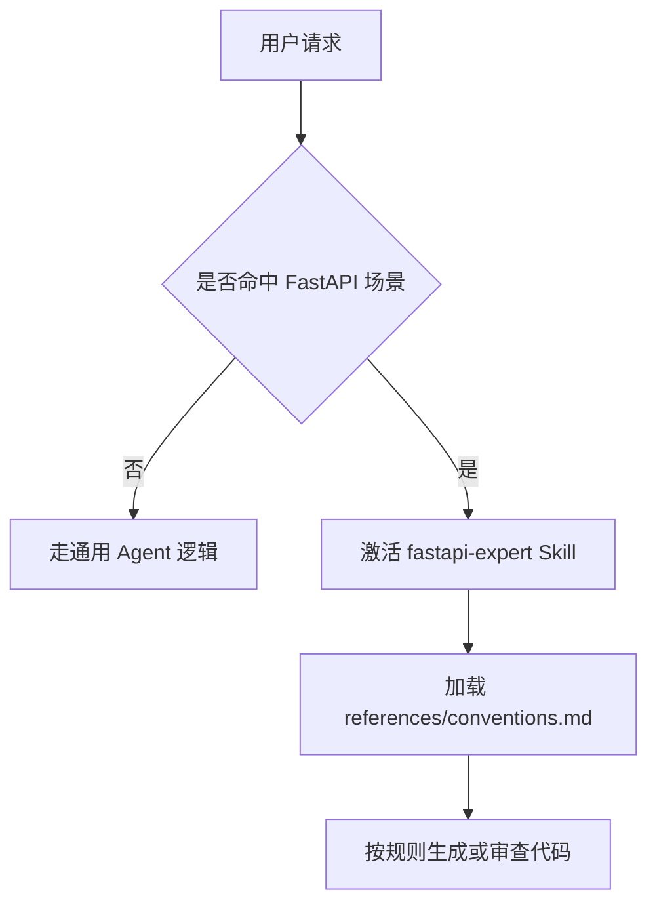
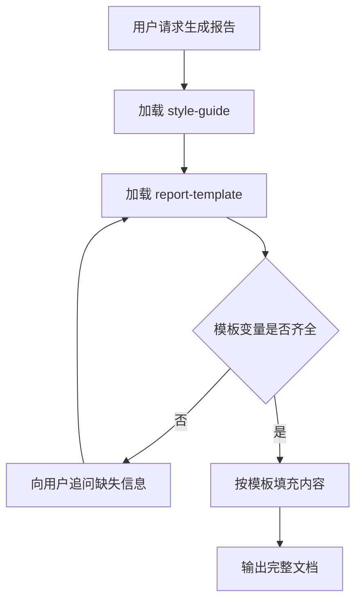
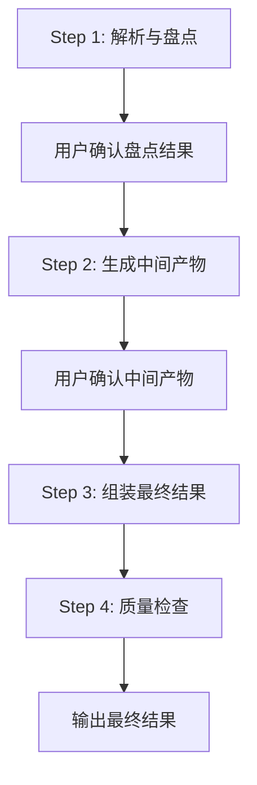
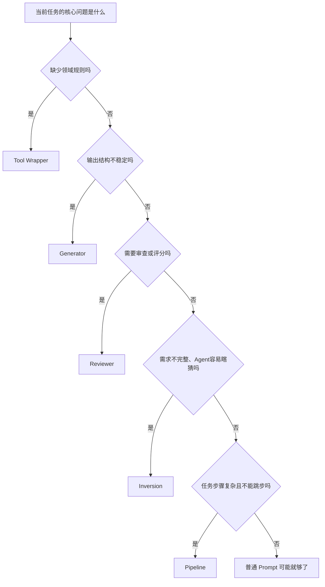

---
date: 2026-03-22
categories:
  - aigc
tags:
  - llm
  - aigc
---

# 别再只盯着 `SKILL.md` 格式了：5 种更值得关注的 Agent Skill 设计模式

当越来越多 Agent 工具开始支持相似的 Skill 组织方式后，很多开发者仍然把注意力放在“外壳”上：

* `SKILL.md` 怎么写
* frontmatter 怎么配
* `references/`、`assets/` 目录怎么摆
* YAML 字段要不要补齐

这些当然重要，但它们解决的，本质上只是**封装格式**的问题。

真正决定一个 Skill 是否好用、是否稳定、是否能复用的，往往不是它“长什么样”，而是它内部的**能力结构怎么设计**。

这也是 Google Cloud Tech 那篇[《5 Agent Skill design patterns every ADK developer should know》](https://x.com/GoogleCloudTech/status/2033953579824758855)真正值得看的地方：

**当 Skill 的包装格式逐渐标准化之后，真正拉开差距的，不再是会不会写 Skill 文件，而是会不会设计 Skill 的内容。**


文章总结了 5 种反复出现的 Skill 设计模式：

1. Tool Wrapper
2. Generator
3. Reviewer
4. Inversion
5. Pipeline

它们不是五个零散技巧，而更像五种常见的 **Agent 能力组织方式**。

<!-- more -->

## 一、为什么“继续堆 Prompt”正在变得越来越低效

很多 Agent 系统一开始都很像这样：

* 在 system prompt 里塞框架知识
* 塞代码规范
* 塞输出格式要求
* 塞评审标准
* 塞多轮交互规则
* 再补一堆“必须严格执行”“不要跳步”“先问清楚再做”的约束

一开始似乎还能工作，但随着能力变多，问题也会越来越明显。

第一，Prompt 会越来越长。
第二，不同规则开始互相干扰。
第三，很多知识只在某些任务里才需要，却被长期塞在上下文中。
第四，维护成本迅速上升，一处改动就可能影响整体行为。

于是，问题就不再是“怎么把 Prompt 写得更全”，而是：

> **能不能把不同类型的能力拆出来，按结构设计，而不是继续往一个总 Prompt 里堆。**

这正是 Skill 设计真正重要的地方。

---

## 二、从“写 Skill 文件”到“设计 Skill 能力”

如果从更抽象的角度看，这 5 种模式其实分别在解决 5 类不同的问题：

| 模式           | 核心作用        | 主要解决的问题          |
| ------------ | ----------- | ---------------- |
| Tool Wrapper | 按需注入领域规则或知识 | Agent 不够专业，输出不稳定 |
| Generator    | 强制输出遵循固定模板  | 输出结构漂移、风格不一致     |
| Reviewer     | 按清单进行审查与评分  | 评审标准分散，难复用       |
| Inversion    | 先收集信息再行动    | Agent 喜欢猜需求、过早生成 |
| Pipeline     | 把任务拆成严格阶段执行 | 复杂任务容易跳步、漏步      |

如果再往上收一层，它们其实对应三类“控制”：

* **上下文控制**：Tool Wrapper、Inversion
* **输出控制**：Generator、Reviewer
* **流程控制**：Pipeline

也就是说，Skill 的本质并不是“多一个 Markdown 文件”，而是：

> **把原本混在 Prompt 里的能力，拆成可以独立设计、独立维护、按需组合的结构模块。**

---

## 三、模式一：Tool Wrapper —— 让 Agent 在特定场景下临时变成专家


先说最容易被误解的一种。

### 3.1 Tool Wrapper 到底是什么

Tool Wrapper 的核心思想可以概括成一句话：

> **把某一类明确的知识、规范或约束封装成一个 Skill，让 Agent 只在需要时加载，并按它来完成任务。**

这里有两个关键词非常关键：

第一，它是**按需加载**的。
第二，它不仅是在“补信息”，更是在**约束行为**。

---

### 3.2 一个很典型的误区

很多人第一次接触 Tool Wrapper 时，都会自然地问一句：

> **是不是要把 skill 都设计成这种类型？**

这个疑问非常典型，也恰好能帮助理解 Tool Wrapper 的边界。

答案是：**不是。**

Tool Wrapper 不是“Skill 的统称”，而只是 Skill 的一种设计模式。它适合解决的是这样一类问题：

* 有一套明确的规则或规范
* 这些规则只在某类任务中才需要
* 你希望它能独立维护
* 你希望 Agent 在该场景里“照着做”，而不是“参考一下”

满足这些条件时，Skill 就很适合设计成 Tool Wrapper。

---

### 3.3 一个最直观的例子：FastAPI 专家 Skill

假设你有一个 Agent，经常要帮助用户编写或审查 FastAPI 代码。

最原始的做法是把所有规则都塞进总 Prompt：

* 使用 `APIRouter`
* 使用 Pydantic 校验
* 统一依赖注入写法
* 所有函数要有类型注解
* 避免直接返回裸 `dict`

但更合理的做法，是把它们拆成一个独立 Skill：

```text
skills/
└── fastapi-expert/
    ├── SKILL.md
    └── references/
        └── conventions.md
```

其中：

* `SKILL.md` 负责定义：何时启用、启用后如何执行
* `references/conventions.md` 负责存放真正的规则内容

于是执行逻辑就变成：



这背后的关键变化是：

> 原来是“模型自己想怎么写”；
> 现在是“模型必须按这套规则来写”。

---

### 3.4 它和 RAG 的区别

Tool Wrapper 最容易和 RAG 混淆，但两者的目标其实不同。

RAG 解决的是：**模型不知道某些事实，需要查资料。**
Tool Wrapper 解决的是：**模型虽然会做，但做法不稳定，需要按规则执行。**

所以两者的区别不在“有没有外部文档”，而在于文档扮演的角色不同：

* **RAG**：提供事实和背景信息
* **Tool Wrapper**：提供规则和执行约束

一句话概括：

> **RAG 更像查资料，Tool Wrapper 更像拿操作手册。**

---

## 四、模式二：Generator —— 不让 Agent 自由发挥，而是让它填模板


如果说 Tool Wrapper 主要控制“按什么规则做”，那么 Generator 主要控制的是：

> **最后输出长什么样。**

### 4.1 Generator 的核心价值

很多时候，模型并不是“不知道该写什么”，而是“每次都写得不一样”。

比如你让 Agent 生成一份技术报告：

* 有时先写摘要
* 有时先写背景
* 有时带结论
* 有时像聊天回复
* 有时像正式文档

这时问题不在内容理解，而在于：

> **输出骨架没有被约束住。**

Generator 的思路就是把“内容”和“结构”拆开：

* 用 `assets/` 放模板
* 用 `references/` 放风格规范
* 用 `SKILL.md` 负责编排填充过程

它不是让模型“自由写”，而是让模型**按模板完成文档**。

---

### 4.2 一个简单例子

```text
skills/
└── report-generator/
    ├── SKILL.md
    ├── assets/
    │   └── report-template.md
    └── references/
        └── style-guide.md
```

执行逻辑通常是：

1. 读取风格规范
2. 读取模板骨架
3. 检查模板变量是否齐全
4. 缺什么就向用户追问
5. 按模板填充，输出完整文档

可以用下面这张图理解：



---

### 4.3 它适合哪些任务

Generator 很适合这类场景：

* 技术报告
* 方案文档
* 周报月报
* PR 描述
* API 文档
* 标准化总结稿

它的价值不在于“让模型写得更华丽”，而在于：

> **把输出稳定性，从靠模型发挥，变成靠模板约束。**

---

## 五、模式三：Reviewer —— 把“怎么评”从 Prompt 里拆出来


很多团队在做代码审查、文档验收、质量打分时，都会把规则直接写进 Prompt：

* 检查命名
* 检查复杂度
* 检查错误处理
* 检查边界条件
* 检查潜在风险

问题是，规则一多，Prompt 就会越来越长，而且越来越难维护。

Reviewer 模式的思路是：

> **把“检查什么”单独存成 checklist，把“如何执行检查”交给 Skill。**

---

### 5.1 Reviewer 的结构

一个典型 Reviewer 往往包含两部分：

* `SKILL.md`：定义审查流程
* `references/review-checklist.md`：定义评审标准

Skill 本身只做这些事：

1. 加载 checklist
2. 理解用户输入内容
3. 按 checklist 逐项检查
4. 按严重等级组织结果
5. 给出修复建议或评分

这类模式的核心思想非常重要：

> **规则是数据，执行是引擎。**

换一份 checklist，Skill 的流程可以不变；
但 Agent 的“评审能力”就会随之变化。

---

### 5.2 为什么它很实用

Reviewer 的价值在于，它把原本写死在 Prompt 里的评审标准变成了**可替换、可维护、可复用**的结构。

比如：

* 换成 Python 风格清单，就是代码质量评审
* 换成 OWASP 检查表，就是安全审计
* 换成文档规范清单，就是内容验收

同一个执行框架，可以承载完全不同的审核体系。

---

### 5.3 它适合哪些场景

Reviewer 特别适合：

* Code Review
* 安全审计
* 内容质检
* 结构化评分
* 交付物验收

如果 Tool Wrapper 主要解决“怎么做”，那 Reviewer 主要解决的就是：

> **怎么评。**

---

## 六、模式四：Inversion —— 不让 Agent 立刻开工，而是先问清楚


Agent 有一个天然倾向：
**一旦看到任务，就想马上给答案。**

这在简单问题上是优点，但在复杂任务里经常会变成问题。

比如用户说：

* 帮我设计一个系统
* 帮我规划一个项目
* 帮我写一个方案

很多时候需求还远远不完整，但 Agent 已经开始“规划”或“设计”了。结果要么靠猜，要么做了很多无效输出。

Inversion 模式就是专门解决这个问题的。

---

### 6.1 它是什么

Inversion 可以理解为一种**控制流反转**：

* 不是用户一次性把信息给全，Agent 直接输出
* 而是 Agent 先变成采访者，按步骤收集约束，再开始生成结果

它的关键不只是“会提问”，而是：

> **通过强制 gating，阻止 Agent 在信息不完整时过早行动。**

---

### 6.2 为什么它叫 Inversion

因为它把默认执行顺序反过来了。

原本是：

```text
用户提需求 → Agent 直接输出
```

变成：

```text
用户提需求 → Agent 先采访 → 收齐信息 → 再输出
```

也就是把流程推动者从“用户”变成了“Agent”。

---

### 6.3 它最适合什么场景

Inversion 特别适合：

* 项目规划
* 系统设计
* 复杂需求澄清
* 咨询型任务
* 高不确定性场景

它的核心价值不是让 Agent 更会猜，而是：

> **尽量减少它必须靠猜的部分。**

---

## 七、模式五：Pipeline —— 把复杂任务拆成不可跳过的工作流


如果说 Inversion 解决的是“别太早开始”，那么 Pipeline 解决的就是：

> **开始之后，也别乱跳步骤。**

很多复杂任务都不是“一步生成”能做好的，而是必须分阶段推进。例如：

* 先盘点对象
* 再补齐 docstring
* 再组装文档
* 最后做质量检查

如果没有流程约束，Agent 很容易：

* 省略中间步骤
* 跳过确认
* 没有验证就直接给最终结果

Pipeline 模式就是为了解决这个问题。

---

### 7.1 Pipeline 的核心思想

Pipeline 的本质是：

> **把复杂任务拆成明确阶段，并为每个阶段设置不可绕过的检查点。**

它不仅要求“有步骤”，还要求“步骤之间有门槛”。

---

### 7.2 一个典型流程



这个模式的重点不是“任务被分成了四步”，而是：

> **在上一步没有完成或没有确认之前，下一步不允许开始。**

---

### 7.3 它适合哪些任务

Pipeline 特别适合：

* 从代码生成文档
* 多阶段内容加工
* 复杂审查与修复
* 需要中间确认的工作流
* 结构化交付任务

如果 Reviewer 更像“检查器”，那 Pipeline 更像一个轻量级的**流程执行器**。

---

## 八、这五种模式最简单的区分方式


如果把它们压缩成一句话，可以这样记：

* **Tool Wrapper**：让 Agent 懂某个领域
* **Generator**：让 Agent 按模板输出
* **Reviewer**：让 Agent 按清单检查
* **Inversion**：让 Agent 先问再做
* **Pipeline**：让 Agent 分阶段执行

或者换一种决策式的理解：



这个决策树背后的核心逻辑是：

> **先判断你要控制的是知识、输出、评审、交互，还是流程。**

---

## 九、真正重要的一点：这些模式不是互斥的，而是可以组合的

这篇文章里最有价值的一点，不只是总结了 5 种模式，而是提醒我们：

> **这些模式是可以组合的。**

比如：

* 一个 Generator 前面可以先接 Inversion

  * 先把变量问完整，再按模板生成

* 一个 Pipeline 最后可以接 Reviewer

  * 先完成流程，再按清单验收

* 一个 Reviewer 本身也可以依赖 Tool Wrapper

  * 先加载某个领域规范，再按规则审查

换句话说，这 5 种模式更像是 5 块“能力积木”，而不是 5 个互相排斥的标签。

---

## 十、重新看 Skill 设计：它其实更像软件架构问题

如果只把 Skill 看成一个 `SKILL.md` 文件，那很容易停留在“语法正确、目录整洁”的层面。

但当你从这 5 种模式往回看，会发现 Skill 真正重要的地方在于：

* 它是不是把领域知识显式封装了
* 它是不是把输出结构独立出来了
* 它是不是把评审标准从 Prompt 中剥离了
* 它是不是能控制交互顺序
* 它是不是能约束复杂任务的执行流程

也就是说，Skill 的本质并不是：

> “把说明文字放进一个规范文件里”

而更像是：

> **把 Agent 的能力做成有边界、有职责、可组合、可维护的模块。**

从这个角度看，Skill 设计越来越像软件架构问题，而不只是 Prompt 工程问题。

---

## 结语

随着越来越多 Agent 工具在 Skill 的包装格式上趋于一致，真正值得拉开差距的，已经不是：

* `SKILL.md` 怎么排版
* YAML 字段怎么凑齐
* 目录是不是足够规范

而是：

> **你有没有把能力设计成结构化模块，而不是继续把一切都压进一个越来越臃肿的总 Prompt。**

Tool Wrapper、Generator、Reviewer、Inversion、Pipeline，这五种模式之所以重要，不是因为它们发明了新的文件结构，而是因为它们提供了一套更接近工程系统的思考方式：

* 哪些知识该按需注入
* 哪些输出该模板化
* 哪些评审该清单化
* 哪些任务必须先澄清
* 哪些流程必须设置检查点

当你开始这样设计 Skill 时，你构建的就不再只是“更长的 Prompt”，而是一个真正有组织的 Agent 能力系统。


## 参考文档

https://x.com/GoogleCloudTech/status/2033953579824758855