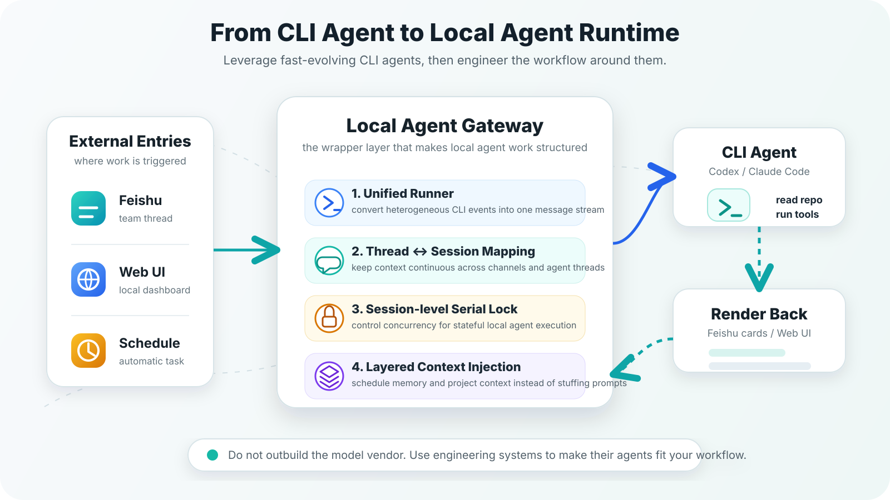
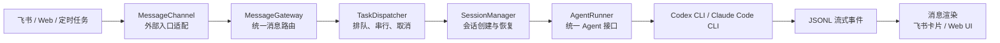
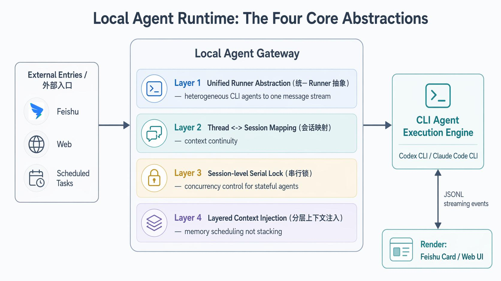
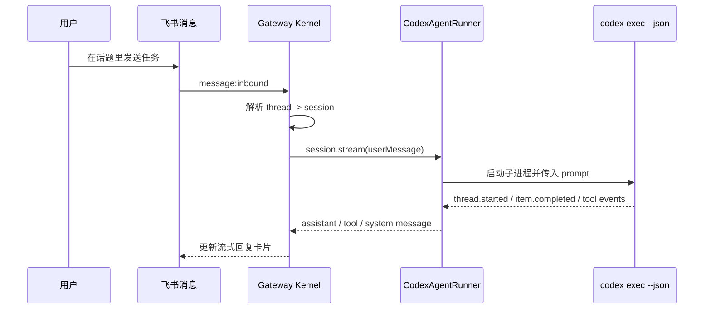
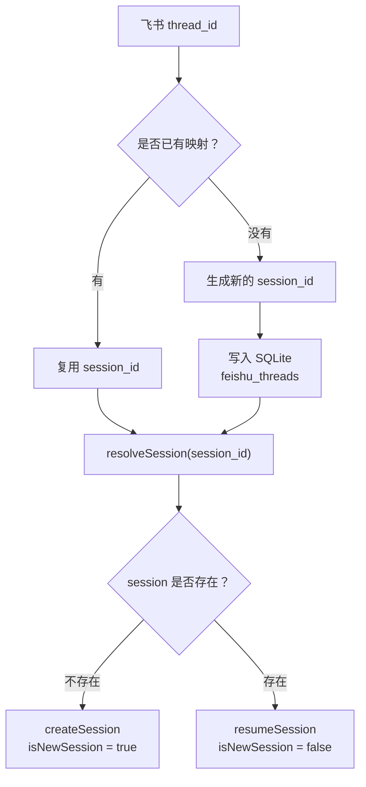
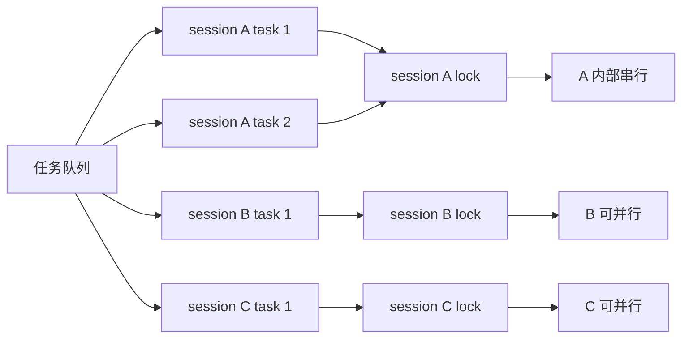
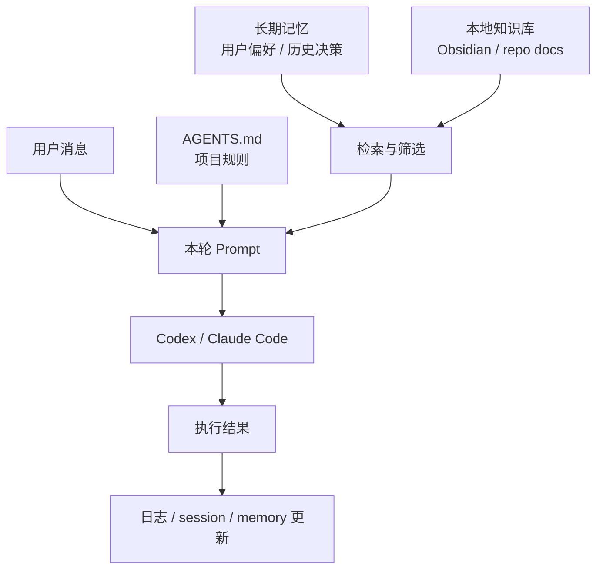

# 从 CLI Agent 到本地 Agent Runtime：一套包装本地 Agent 的工程模式



## 文档目标

- 解释 Codex / Claude Code 这类 CLI Agent 如何从“终端里的命令”变成“工作流里的 Runtime”
- 用 Agentara 作为具体例子，拆解包装本地 Agent 需要补齐的工程层
- 总结这套模式的适用场景、风险边界和可迁移原则

## 阅读受众

- 已经使用过 Codex、Claude Code 或类似 Coding Agent 的开发者
- 想把本地 Agent 接入飞书、Web、定时任务或知识库工作流的同学
- 希望理解 Agentara 这类项目工程本质，而不是只看安装和配置步骤的读者

## 0. Insight

- **本地 Agent 的难点不只在模型**：真正决定它能否进入真实工作流的，是模型外面的消息通道、会话系统、任务队列、记忆注入和可观测 UI
- **包装层的本质是 Agent Gateway**：它不替代 Codex / Claude Code 的执行能力，而是把这些 CLI Agent 包装成可交互、可持续、可拓展的本地 Agent Runtime
- **核心抽象只有四层**：统一 Runner、thread ↔ session 映射、session 级串行锁、分层上下文注入——四层补齐，CLI Agent 就成了 Runtime
- **这套模式有明确边界**：一旦远程消息能触发本地执行，权限、目录、审批、日志和可撤销性就必须先于功能扩展被设计清楚
- **比起造一个更强的 Agent，更现实的是借力**：模型和 AI CLI 仍在高速迭代，工程侧真正的价值在于把这些能力接入稳定工作流——这也是本文真正想说的

本文会用开源项目 Agentara 作为贯穿全文的例子。

它同时支持 Claude Code 和 OpenAI Codex，通过飞书收消息，通过本地服务管理会话与任务，再把 Agent 的流式输出渲染回飞书或 Web Dashboard。

本文不展开 Agentara 的安装与配置，而是借这个项目回答一个更通用的问题：

**一个本地 CLI Agent，需要补上哪几层工程，才能从终端命令变成工作流里的 Runtime。**

<!-- more -->

## 1. 现象：为什么大家都在“包装”本地 Agent

过去我们使用 AI Agent 的主要入口是终端或 IDE：打开 Codex，输入任务，等它读代码、改文件、跑命令。这个形态直接、高效，但边界也很明显：

- 交互入口被锁在本地终端
- 长任务状态难以被外部系统感知
- 团队协作入口，比如飞书、Slack、群聊，很难直接接上
- 记忆、知识库、定时任务、外部触发器，都需要额外系统承载
- 多会话、多任务、取消、恢复、日志、用量展示，这些工程问题通常不会由 CLI 自己完整处理

于是，越来越多工具开始做同一类事情：

**不自己训练模型，而是把已经存在的 CLI Agent 当作底层执行引擎，在它外面包一层交互与编排系统。**

Agentara 就是这条路线上一个相当完整的例子。

这背后的趋势可以浓缩成一句话：

> CLI Agent 正在从“命令行工具”，变成一种“本地 Agent Runtime”。

普通聊天机器人和本地 Agent Runtime 的差异，可以先用这张图压缩理解：


> 图 1：普通聊天机器人更像无状态消息转发；本地 Agent Runtime 则是一套围绕多入口、会话、并发、上下文和可观测性搭起来的工程系统。

那么要完成这层“包装”，工程上到底需要补齐什么？

接下来先用一个 Agent Gateway 流程图看整体链路，再逐层拆开。

## 2. 全貌：包装层的本质是一个 Agent Gateway

无论用什么技术栈实现，这类“包装层”的工程结构都高度相似——它本质上是一个 **Agent Gateway**。



这个 Gateway 流程图里最关键的不是某个具体模块，而是它做的一件事：

**把“外部交互”和“本地 Agent 执行”彻底隔离开。**

外部系统不必知道 Codex 怎么 resume，也不必理解 Claude Code 的 stream-json 格式；反过来，底层 Agent 也不必知道消息来自飞书、网页还是定时任务。

夹在中间的 Gateway，负责协议转换、会话映射、任务调度和输出渲染。

这正是 Gateway 的意义：

**它本身不是能力，而是让能力可以被更多场景稳定调用。**

而真正撑起这个 Gateway 的，是四个核心技术抽象。它们才是这套模式的骨架。

接下来四节，逐个拆开。



> 图 2：Gateway 内部的四个核心抽象——统一 Runner、会话映射、串行锁、分层上下文注入。下面四节逐一展开。

## 3. 抽象一：统一 Runner 接口——把异构 CLI 收敛成一种消息流

第一个问题是：底层 Agent 各不相同（Codex、Claude Code、未来还有更多），输出协议也各不相同。

包装层怎么做到不被某个具体 Agent 绑死？

答案是一个极小的抽象——**统一 Runner 接口**。它对底层 Agent 只提一个要求：能接收一条用户消息，并返回一个流式消息迭代器。以 Agentara 的 `AgentRunner` 为例：

```ts
interface AgentRunner {
  readonly type: string;

  stream(
    userMessage: UserMessage,
    options: AgentRunOptions,
  ): AsyncIterableIterator<SystemMessage | AssistantMessage | ToolMessage>;
}
```

这个抽象很小，却很关键——它把包装层与具体 Agent 实现彻底解耦了：

| Runner 类型 | 底层执行方式 | 输出协议 | Runner 做的事情 |
| --- | --- | --- | --- |
| Claude Code | `claude --print --output-format stream-json` | stream-json | 解析 system / assistant / tool_result |
| Codex | `codex exec --json` | JSONL events | 解析 thread、message、command、file_change、mcp_tool_call |

注意它**没有**把 Codex 伪装成一个标准的 OpenAI Chat API。

它做的是更工程化的事：

**把不同 CLI Agent 的异构流式事件，映射成一套统一的内部消息类型。**

这层映射看着只是适配代码，实则是整个系统能否扩展的命门。

未来要接入 Gemini CLI、Aider 或任何自研 Agent，只需实现一个新的 Runner——外层的飞书、任务队列、Web UI 全部可以复用。

把这层抽象落到 Codex 上是这样的：runner 启动一个子进程，

```bash
codex exec --model <model> --json --skip-git-repo-check <prompt>
```

已有会话则带上 resume：

```bash
codex exec --model <model> --json resume <thread_id> <prompt>
```

随后读取 stdout 中的 JSONL 事件，逐条转成内部消息。整个流程是这样流转的：



这里有三个通用要点，适用于任何 CLI Agent 的包装：

- **CLI 始终是执行主体**：读仓库、调工具、跑命令、改文件的是底层 Agent，包装层只负责调用与转译
- **结构化输出（`--json`）是命门**：没有它，外层只能读自然语言，无法区分最终回答、命令执行、文件修改、工具调用和错误
- **resume 能力决定多轮会话是否成立**：没有稳定的 resume，外部入口里的连续回复就很难对齐到底层 Agent thread

## 4. 抽象二：thread ↔ session 映射——多入口系统的上下文连续性

一旦交互入口从终端搬到飞书话题（thread），就冒出一个新问题：

**下一条飞书回复，应该进入哪个 Agent 会话？**

终端里这个问题不存在——一个终端窗口天然就是一个上下文。

但飞书是多话题、多人、异步的，消息流本身不携带“我属于哪个任务”的信息。

于是必须显式维护一张 **thread 到 session 的映射表**。



这个设计看着朴素，但它解决的恰恰是多入口系统里最容易翻车的问题：

**上下文连续性。**

没有这层映射，飞书只是一条消息流；有了它，一个 thread 才真正变成一个能被 Agent 持续理解的任务容器。

这也是这类系统与“简单 webhook 转发”的本质区别：

- 简单转发只处理“这一条消息”
- 会话映射处理的是“这一串消息属于同一个任务”，并能一路对齐到底层 Agent 的 thread

## 5. 抽象三：session 级串行锁——有状态 Agent 的并发控制

本地 Agent 有个很现实的特性：它不是普通的无状态 API。

一次 Codex 运行可能会读文件、改文件、跑命令、写入自己的 session 状态。如果同一个 session 里同时进来两条消息，让两个子进程并发跑，就可能出现：

- 两轮对话同时 resume 同一个 thread
- 同一个仓库被两个任务同时修改
- 后发的消息先完成，先发的消息反而后完成
- 用户看到的飞书回复顺序错乱
- `/stop` 不知道该停哪一个任务

所以这类系统的任务调度必须遵循一条核心策略：

> 同一 session 内串行执行，不同 session 之间可以并行执行。

实现上通常是按 `session_id` 维护一把锁（或一个串行队列）：同一 session 的任务排队执行，锁释放后才取下一个；不同 session 各持各的锁，互不阻塞。

换句话说，串行锁锁的是“同一 session 的任务队列”，而不是“子进程”本身。



这正是从“聊天机器人”走向“Agent Runtime”必须补上的那层工程。

模型聪不聪明只是一个维度；能不能长期稳定运行，更取决于任务状态、并发控制、取消恢复和错误处理是否扎实。

## 6. 抽象四：分层上下文注入——是调度记忆，而不是堆砌记忆

最后一个抽象，关于“记忆”。我一开始以为记忆系统是某种神秘的模型能力，但读下来发现，在本地 Agent 工程里，它更像是一个**上下文调度问题**。

以 Codex 为例，可注入上下文的位置就有很多种，各自承担不同角色：

- `AGENTS.md`：项目级稳定规则
- prompt 前缀：本轮任务相关的动态上下文
- MCP resource / tool：按需读取的外部知识
- 本地检索结果：从知识库、日报、历史记录中取出的相关片段
- session summary：长会话压缩后的历史状态
- workspace 文件：让 Agent 直接通过文件系统读取上下文



这也解释了为什么“记忆”不能粗暴地全塞进去。上下文不是越多越好，它至少带来三类风险：

- **污染风险**：旧规则覆盖当前项目规则
- **预算风险**：无关信息挤占真正重要的上下文
- **权限风险**：远程消息可能诱导 Agent 读取或发送不该碰的信息

所以更成熟的做法不是“有记忆就注入”，而是先做判断：

**这条记忆与当前任务是否相关、是否仍然有效、是否应当覆盖项目原生规则。**

一句话，上下文工程不是堆消息，而是设计信息在正确时机进入模型视野的方式。

## 7. 把四层拼起来：能力的拓展空间

统一 Runner、会话映射、串行锁、分层上下文——这四层一旦补齐，本地 Agent 就不再只是一个“会回答的模型”。

它会成为一个可以被系统调用、被用户协作、被长期维护的 Runtime。拓展空间随之打开：

| 可拓展方向 | 具体形态 | 背后复用的能力 |
| --- | --- | --- |
| 多渠道入口 | 飞书、Slack、Telegram、邮件、网页控制台 | MessageChannel / MessageGateway |
| 长期任务 | 定时总结、PR 监控、知识库整理、日报生成 | TaskDispatcher / Scheduler |
| 个人知识助理 | Codex + Obsidian + 本地记忆 | 分层上下文注入 |
| 仓库维护助手 | 自动读 repo、生成 issue、检查 PR、补测试 | 统一 Runner / workspace |
| 团队协作 Agent | 群聊里创建任务、跟进状态、同步结论 | 会话映射 / 流式渲染 |
| 可观测面板 | session、usage、日志、任务状态、工具调用 | Web Dashboard / 本地数据库 |

真正具备迁移价值的，不是某一段代码，而是这组工程问题：

1. 外部事件，如何变成标准的内部消息？
2. 一条消息，如何找到正确的会话？
3. 一个会话，如何恢复到底层 Agent 的 thread？
4. 同一会话里的多个任务，如何串行？
5. Agent 的工具调用和文件修改，如何渲染给用户？
6. 长期记忆如何注入，又不污染上下文？
7. 失败、取消、重试、日志和用量，如何对用户可见？

## 8. 边界和风险

这套模式很有想象空间，但不能只盯着兴奋点看。因为它连接的是**远程消息入口**和**本地执行环境**，风险天然比普通聊天机器人高。

| 风险点 | 典型场景 | 影响 | 处理建议 |
| --- | --- | --- | --- |
| 远程消息触发本地命令 | 飞书、Slack、Web 消息直接触发 Codex 执行 | 可能访问本地文件、修改仓库、执行危险命令 | 明确运行目录、权限范围、审批策略和日志记录 |
| CLI 协议不是稳定 API | 依赖 `codex exec --json` 或 `claude --output-format stream-json` 解析事件 | CLI 输出字段变化会影响 Runner 适配 | 用测试覆盖 assistant message、command execution、file change、MCP tool call、error / failed turn、session started / resume |
| 记忆注入覆盖项目规则 | 长期记忆、个人偏好、项目规则同时进入上下文 | 旧规则可能污染当前项目判断 | 采用“检索 → 筛选 → 注入”，让 `AGENTS.md`、`CLAUDE.md`、README 等项目原生规则保持更高优先级 |
| 用量展示被误读成 billing | 从本地 session 日志推断 token 和 rate limit telemetry | 用户可能误以为这是官方账单或精确用量 | 明确标注为本地速率限制可见性，不包装成官方 billing 指标 |

这里尤其需要注意权限问题。

如果飞书里的一句话就能触发 Codex 在本地执行命令，系统必须先回答几个问题：

- 运行目录在哪里
- 是否允许修改文件
- 是否允许执行危险命令
- 是否允许访问用户目录
- 是否允许读取密钥、token 或浏览器状态

Agentara 当前对 Codex 采用了绕过审批和 sandbox 的执行方式，这让交互更顺滑，但也意味着它更适合**个人受控环境**，不建议直接暴露给不可信群聊。

如果要放到团队群或更开放的入口里，安全边界必须先于功能扩展被设计清楚。

## 9. 为什么是“借力”，而不是“替代”

前面八节讲的都是“怎么做”。

但在动手之前，其实还有一个更上位的判断：

**面对快速迭代的模型和 AI CLI，工程侧到底该把力气花在哪里？**

我的结论是：更现实的方向是基于 Codex / Claude Code 这类工具做包装，而不是从零开始做一个“更强的 Agent”。

这类 AI CLI 和它背后的模型能力仍在高速迭代：模型推理、工具调用、代码理解、终端执行，以及和 IDE / CLI 的结合，厂商的投入会持续把这层底座往前推。

对个人或小团队来说，真正现实的策略不是在这些基础能力上正面超过它们，而是把它们当成一层持续升级的底座。

如果说第 7 节回答的是“能拓展出什么”，那么这里想回答的是“在资源有限时，应该优先往哪里投”：

| 投入方向 | 要解决的问题 |
| --- | --- |
| 接入真实协作入口 | 让 Agent 不只停留在终端，而是进入飞书、Web、定时任务等实际工作入口 |
| 分层上下文管理 | 让 Agent 能拿到正确的项目规则、知识库信息和任务现场，而不是简单堆 prompt |
| 会话与任务调度 | 降低多轮对话、并发执行、长任务恢复带来的状态混乱 |
| 权限与可观测性 | 用审批、日志、任务状态和 Dashboard 控制远程触发本地执行的风险 |
| 工作场景适配 | 把通用 AI CLI 能力转成适合个人知识库、团队协作和仓库维护的工作模式 |

换句话说，AI 工程应用的价值不一定在于“造一个新的模型能力”。

更重要的是：

**把已经快速演进的 AI 能力，组织成更稳定的工作流和工作模式。**

## 10. 一点个人理解：拓展本地 Agent 的真正含义

最初看 Agentara，我关注的是“能不能把 Codex 接到飞书”。

但顺着这套模式拆下来，我最大的收获其实是一句更普适的话：

**本地 Agent 的能力，不只由模型决定，而是由模型外面那层工程系统共同决定。**

模型负责推理、读代码、调工具、执行修改；包装层负责让这些能力进入真实场景：

- 飞书提供协作入口
- session 提供上下文连续性
- task queue 提供执行秩序
- Web UI 提供可见状态
- memory 提供长期上下文
- runner 把 CLI Agent 变成可流式调用的 Runtime

这让我重新理解了“拓展 Codex”的含义：它不一定是改 Codex 本身，也不一定是训练新模型。

很多时候，真正有效的拓展发生在模型**外部**。

它做的是把 Agent 接入正确的入口，喂它正确的上下文，约束它的执行边界，记录它的状态，再把结果回流到用户真正工作的地方。

## 11. 可迁移原则

如果要把这套经验迁移到自己的 Agent 工程实践里，我会优先记住这五条原则：

| 原则 | 核心含义 | 实践提醒 |
| --- | --- | --- |
| 先设计运行时，再设计 prompt | 长任务 Agent 不能只靠 prompt | 先想清楚任务容器、会话、状态、取消、恢复、日志和交付物分别落在哪里 |
| 把 CLI Agent 当成本地执行引擎 | Codex / Claude Code 的价值不只是回答，而是读 repo、跑命令、调工具、改文件 | 外层系统应该尊重并包装这份能力，不要把它降级成普通聊天模型 |
| 会话映射是多入口系统的地基 | 飞书 thread、Web session、定时任务、底层 Agent thread 必须能彼此对齐 | 否则系统表面能跑，实际很容易发生上下文漂移 |
| 上下文工程要分层 | 稳定规则、任务现场、长期记忆、历史摘要、本地文件不应该混成一坨 | 不同信息应在不同阶段、以不同优先级进入 Agent 视野 |
| 安全边界要早于功能扩展 | 远程消息一旦能触发本地执行，权限就变成基础设施 | 目录、审批、日志和可撤销性需要在功能扩展前设计清楚 |

## 结尾

绕开具体项目来看，这套模式给我最大的启发是一个更大的方向：

**本地 CLI Agent，可以成为个人和团队工作流里的 Runtime。**

它们不必变成云端 API，也不必被重新包装成又一个聊天产品。

只要外层系统能补齐统一 Runner、会话映射、任务调度、分层上下文和安全边界这几层工程，本地 Agent 就能自然地走进更多真实工作场景。

Agentara 只是证明了这条路走得通——而这套模式，你完全可以拿去搭自己的那一个。

## 参考

- [MagicCube/agentara](https://github.com/MagicCube/agentara)
