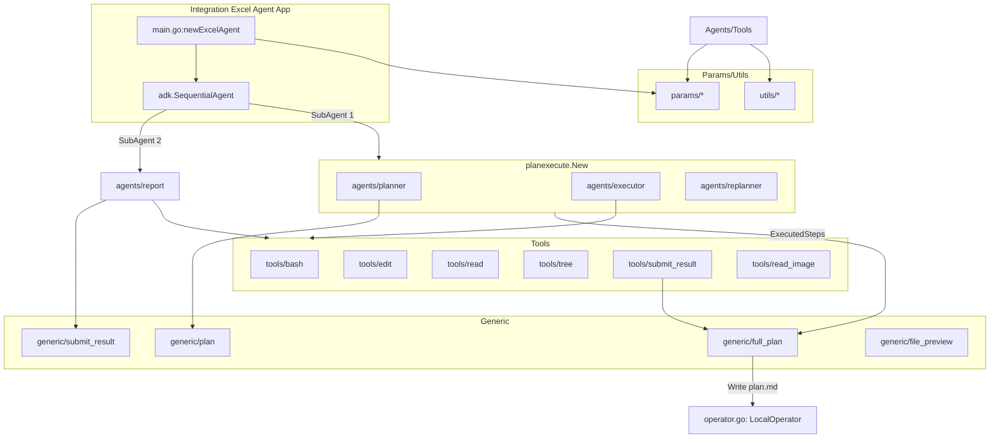
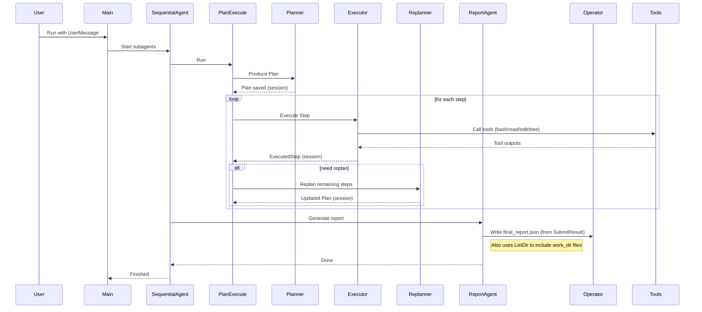
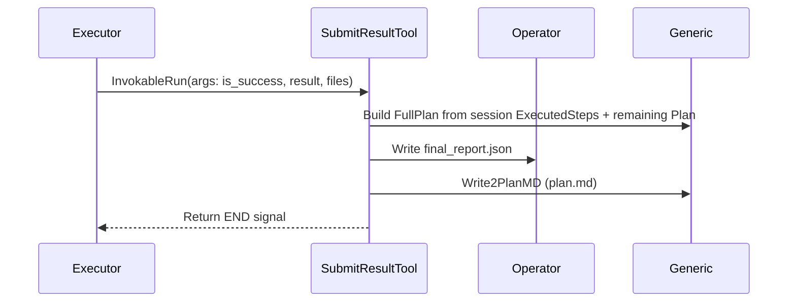
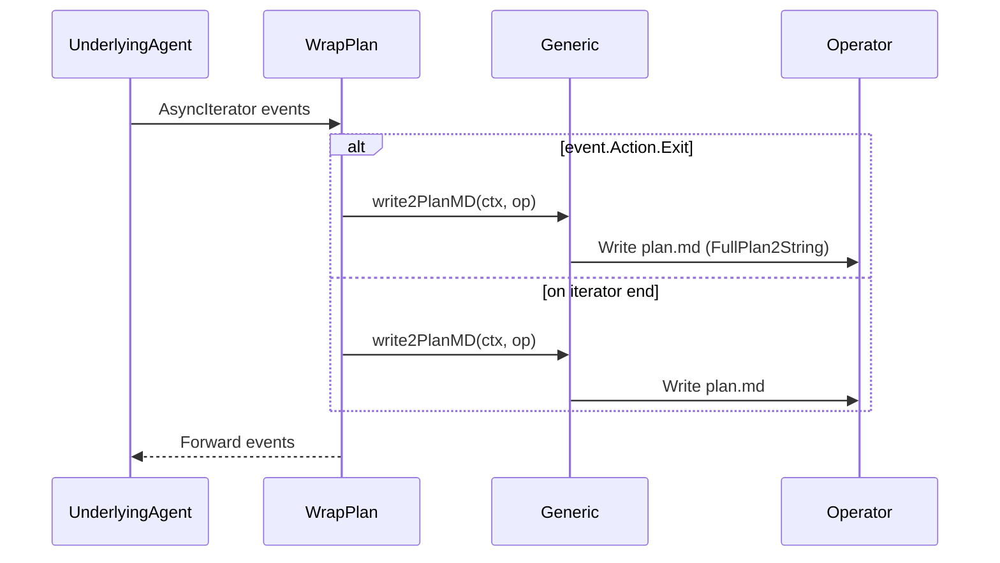

# multiagent/integration-excel-agent

> https://github.com/cloudwego/eino-examples/tree/main/adk/multiagent/integration-excel-agent

**架构分析**

- 模块化架构图

- 编排引擎模式
  - 顺序编排：SequentialAgent 串联 plan-execute-replan 与报告产出
    - 参考 main 组装与运行: [main.go#L153-L198](https://github.com/cloudwego/eino-examples/blob/main/adk/multiagent/integration-excel-agent/main.go#L153-L198)
  - 责任链/循环控制：planexecute 在 Planner→Executor→Replanner 之间迭代推进
  - 工具过滤器：工具以 InvokableTool 形式组合，作为可插拔的处理节点
  - 事件驱动：各 Agent Run 返回 AsyncIterator；wrap_plan 在事件流结束时落盘

- 关键控制与数据流
  - 控制流：main→SequentialAgent→planexecute 循环→ReportAgent→完成；wrap_plan 在 Exit/迭代结束后写计划
  - 数据流：
    - 输入：schema.Message(User)、上下文参数 params（file_path、work_dir、previews、task_id）
    - 会话：adk.AddSessionValue/GetSessionValue 管理 Plan 与 ExecutedSteps
    - 产物：SubmitResult.Result + Files；FullPlan 输出至 plan.md 与 final_report.json

**输入输出机制**

- 数据结构规范
  - Plan/Step
    - 结构与序列化：[generic/plan.go#L26-L46](https://github.com/cloudwego/eino-examples/blob/main/adk/multiagent/integration-excel-agent/generic/plan.go#L26-L46)
  - FullPlan/PlanStatus 与写入
    - 写 plan.md：[generic/full_plan.go#L82-L86](https://github.com/cloudwego/eino-examples/blob/main/adk/multiagent/integration-excel-agent/generic/full_plan.go#L82-L86)
  - SubmitResult/Files 与文件枚举
    - 列举工作目录文件：[generic/submit_result.go#L48-L81](https://github.com/cloudwego/eino-examples/blob/main/adk/multiagent/integration-excel-agent/generic/submit_result.go#L48-L81)

- 消息转换中间件
  - ReportAgent 将上下文与会话注入 Prompt（file_path、work_dir、work_dir_files、plan、current_time）
    - 输入生成：[agents/report/report_agent.go#L98-L156](https://github.com/cloudwego/eino-examples/blob/main/adk/multiagent/integration-excel-agent/agents/report/report_agent.go#L98-L156)
  - 工具封装与请求修复
    - ToolRequestRepairJSON 的包装模式：[agents/report/report_agent.go#L64-L74](https://github.com/cloudwego/eino-examples/blob/main/adk/multiagent/integration-excel-agent/agents/report/report_agent.go#L64-L74)

- 完整传递链路
  - main 设置上下文与工作目录→SequentialAgent 运行
    - [main.go#L76-L88](https://github.com/cloudwego/eino-examples/blob/main/adk/multiagent/integration-excel-agent/main.go#L76-L88)
    - [main.go#L97-L109](https://github.com/cloudwego/eino-examples/blob/main/adk/multiagent/integration-excel-agent/main.go#L97-L109)
  - planexecute：
    - SubmitResult 写 final_report.json 与计划：
      - [tools/submit_result.go#L119-L127](https://github.com/cloudwego/eino-examples/blob/main/adk/multiagent/integration-excel-agent/tools/submit_result.go#L119-L127)
  - wrap_plan：
    - 汇总 ExecutedSteps 与剩余 Plan，填充 Files 并写 plan.md：
      - [agents/wrap_plan.go#L91-L140](https://github.com/cloudwego/eino-examples/blob/main/adk/multiagent/integration-excel-agent/agents/wrap_plan.go#L91-L140)

**核心知识点**

- 设计模式
  - 管道-过滤器：Agent→Tools→Prompt→SubmitResult
  - 责任链/循环控制：Planner→Executor→Replanner 周期
  - 事件驱动：AsyncIterator 事件流，Action.Exit 终止钩子
  - 上下文传播：params 与会话键在 context 中传递

- 异常处理
  - panic 恢复：wrap_plan goroutine 保护
    - [agents/wrap_plan.go#L56-L63](https://github.com/cloudwego/eino-examples/blob/main/adk/multiagent/integration-excel-agent/agents/wrap_plan.go#L56-L63)
  - 错误传播：必需上下文缺失直接返回；RunCommand 格式化错误信息
    - [operator.go#L76-L83](https://github.com/cloudwego/eino-examples/blob/main/adk/multiagent/integration-excel-agent/operator.go#L76-L83)

- 并发与资源管理
  - 并发：wrap_plan 事件监听与转发不阻塞主迭代
    - [agents/wrap_plan.go#L56-L86](https://github.com/cloudwego/eino-examples/blob/main/adk/multiagent/integration-excel-agent/agents/wrap_plan.go#L56-L86)
  - 资源：Operator 设置工作目录、捕获 stdout/stderr；WriteFile 权限；ListDir 跳过隐藏文件与递归

**组件职责对比**

| 组件                  | 职责                                               | 关键接口/方法                 | 代码参考                                                     |
| --------------------- | -------------------------------------------------- | ----------------------------- | ------------------------------------------------------------ |
| main.go               | 组装上下文、创建代理、运行流程、准备工作目录与输入 | newExcelAgent、Runner.Run     | [main.go#L153-L198](https://github.com/cloudwego/eino-examples/blob/main/adk/multiagent/integration-excel-agent/main.go#L153-L198) |
| SequentialAgent       | 顺序编排子代理（PlanExecute、Report）              | NewSequentialAgent            | [main.go#L186-L192](https://github.com/cloudwego/eino-examples/blob/main/adk/multiagent/integration-excel-agent/main.go#L186-L192) |
| Planner               | 生成计划 Plan                                      | NewPlanner                    | [agents/planner/planner.go](https://github.com/cloudwego/eino-examples/tree/main/adk/multiagent/integration-excel-agent/agents/planner/planner.go) |
| Executor              | 执行一步并使用工具                                 | NewExecutor                   | [agents/executor/executor.go](https://github.com/cloudwego/eino-examples/tree/main/adk/multiagent/integration-excel-agent/agents/executor/executor.go) |
| Replanner             | 根据进展重规划剩余步骤                             | NewReplanner                  | [agents/replanner/replanner.go](https://github.com/cloudwego/eino-examples/tree/main/adk/multiagent/integration-excel-agent/agents/replanner/replanner.go) |
| ReportAgent           | 根据文件内容生成报告                               | NewReportAgent、GenModelInput | [agents/report/report_agent.go#L40-L163](https://github.com/cloudwego/eino-examples/blob/main/adk/multiagent/integration-excel-agent/agents/report/report_agent.go#L40-L163) |
| wrap_plan             | 在流结束时写 plan.md（含 Files）                   | write2PlanMD                  | [agents/wrap_plan.go#L91-L140](https://github.com/cloudwego/eino-examples/blob/main/adk/multiagent/integration-excel-agent/agents/wrap_plan.go#L91-L140) |
| generic/plan          | Plan/Step 定义与序列化                             | FirstStep                     | [generic/plan.go#L26-L46](https://github.com/cloudwego/eino-examples/blob/main/adk/multiagent/integration-excel-agent/generic/plan.go#L26-L46) |
| generic/full_plan     | FullPlan 组装与写入                                | Write2PlanMD                  | [generic/full_plan.go#L82-L86](https://github.com/cloudwego/eino-examples/blob/main/adk/multiagent/integration-excel-agent/generic/full_plan.go#L82-L86) |
| generic/submit_result | 执行结果与文件清单                                 | ListDir、String               | [generic/submit_result.go#L37-L46](https://github.com/cloudwego/eino-examples/blob/main/adk/multiagent/integration-excel-agent/generic/submit_result.go#L37-L46) |
| tools/*               | 基础工具封装（bash/edit/read/tree/submit_result）  | InvokableRun                  | [tools/submit_result.go#L88-L127](https://github.com/cloudwego/eino-examples/blob/main/adk/multiagent/integration-excel-agent/tools/submit_result.go#L88-L127) |
| operator.go           | 命令/文件操作实现                                  | RunCommand、WriteFile         | [operator.go#L42-L44](https://github.com/cloudwego/eino-examples/blob/main/adk/multiagent/integration-excel-agent/operator.go#L42-L44) |

**典型执行场景序列图**

- 场景一：Plan-Execute-Replan-Report

- 场景二：SubmitResult 工具终止并写计划

- 场景三：wrap_plan 在事件流结束时写 plan.md

**关键代码调用链路分析**

- 组装与运行：main → SequentialAgent → planexecute.New
  - [main.go#L153-L198](https://github.com/cloudwego/eino-examples/blob/main/adk/multiagent/integration-excel-agent/main.go#L153-L198)
- 报告输入转换：ReportAgent
  - [agents/report/report_agent.go#L98-L156](https://github.com/cloudwego/eino-examples/blob/main/adk/multiagent/integration-excel-agent/agents/report/report_agent.go#L98-L156)
- SubmitResult 工具：写 final_report.json 与计划
  - [tools/submit_result.go#L88-L127](https://github.com/cloudwego/eino-examples/blob/main/adk/multiagent/integration-excel-agent/tools/submit_result.go#L88-L127)
- wrap_plan：汇总并写 plan.md（含 Files）
  - [agents/wrap_plan.go#L91-L140](https://github.com/cloudwego/eino-examples/blob/main/adk/multiagent/integration-excel-agent/agents/wrap_plan.go#L91-L140)
- Operator：文件/命令操作
  - [operator.go#L42-L44](https://github.com/cloudwego/eino-examples/blob/main/adk/multiagent/integration-excel-agent/operator.go#L42-L44)
  - [operator.go#L54-L83](https://github.com/cloudwego/eino-examples/blob/main/adk/multiagent/integration-excel-agent/operator.go#L54-L83)

**价值点提炼**

- 改进之处
  - 模块解耦：Planner/Executor/Replanner/Report 独立协作，易维护与替换
  - 产物结构化：FullPlan + SubmitResult 标准化产出，易于生成报告与历史回溯
  - 观测性：事件流与流式输出便于实时追踪和调试

- 性能实践
  - 流式输出提升响应体验（EnableStreaming）
  - 工具直返减少不必要轮询（SubmitResultReturnDirectly）
  - 迭代上限避免过度计算（MaxIterations）

- 可复用片段
  - 上下文参数读取：[params/params.go#L43-L54](https://github.com/cloudwego/eino-examples/blob/main/adk/multiagent/integration-excel-agent/params/params.go#L43-L54)
  - 文件枚举为交付清单：[generic/submit_result.go#L48-L81](https://github.com/cloudwego/eino-examples/blob/main/adk/multiagent/integration-excel-agent/generic/submit_result.go#L48-L81)
  - 计划写入 Markdown：[generic/full_plan.go#L82-L86](https://github.com/cloudwego/eino-examples/blob/main/adk/multiagent/integration-excel-agent/generic/full_plan.go#L82-L86)

**架构验证方案**

- 目标
  - 验证从用户输入到 plan.md/final_report.json 的产出链路
  - 验证 ReportAgent 对输入文件的读取与报告生成
  - 验证 wrap_plan 在未调用 SubmitResult 时仍能输出计划

- 步骤
  - 环境
    - Go 1.24.7+
    - 配置环境变量（可选）：
      - EXCEL_AGENT_INPUT_DIR 设置附件输入路径（绝对路径）
      - EXCEL_AGENT_WORK_DIR 设置工作目录根（绝对路径，程序会加 /${uuid}）
    - 参考文档说明：[integration-excel-agent](https://github.com/cloudwego/eino-examples/tree/main/adk/multiagent/integration-excel-agent)
  - 运行
    - 在仓库根执行：go run ./adk/multiagent/integration-excel-agent
    - 修改 main.go 的 query 测试不同任务
  - 验证
    - 工作目录内检查：
      - plan.md 是否生成、包含"### 任务计划"
      - final_report.json 是否存在（当 SubmitResult 被调用）
      - Files 列表是否反映工作目录内容（wrap_plan 使用 ListDir 填充）
  - 场景覆盖
    - 统计与汇总类（触发 Executor + SubmitResult）
    - 读取与分析类（触发 ReportAgent）
    - 多步任务（验证 Replanner 的剩余步骤拼接）
  - 结果评估
    - 计划条目与执行步数一致性
    - 报告引用文件路径与内容正确性
    - 必要上下文缺失时的错误提示是否清晰（如 work_dir not found）