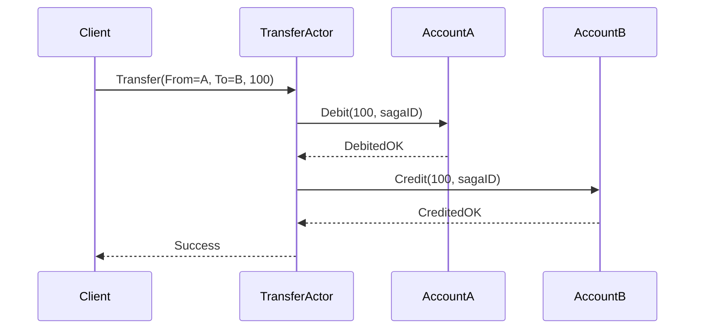


# Actor Model ≠ 分布式事务 —— 如何在一致性与并发之间做取舍？

## 1. “Actor = 微型单机数据库”

在 Actor 语境里，每个 Actor
* 拥有 **私有、串行化访问** 的状态（堪比单线程的内存数据库），
* 对外通过 **异步消息** 交流。

因此：
* **Actor 内部** 可以轻松做到 *线性一致*——因为同时只有 1 条消息被处理，没有并发写。
* **Actor 之间** 则呈现松耦合、最终一致特征，需要额外协议来保证跨 Actor 的业务一致性。

---

## 2. 与传统分布式一致性的差异

| 维度                     | RDB 事务 (2PC)          | 分布式 KV (Raft)         | Actor Model |
|--------------------------|-------------------------|--------------------------|-------------|
| 一致性级别              | 强一致 / ACID           | 强一致 (线性化)          | Actor 内强、一致；跨 Actor 最终一致 |
| 并发控制                | 锁/日志                 | 共识日志                 | 单线程处理，无锁 |
| 代价                     | 两阶段提交 + 锁时间     | 写放大、复杂选举         | 无分布式锁，但需要补偿逻辑 |
| 失败恢复                | 日志回放 / 重放         | 自动 Leader 选举         | Actor 重启 + Crash Buffer |
| 典型模式                | 银行转账                | 配置中心、元数据存储      | 电信会话、游戏房间、竞价撮合 |

> 结论：Actor Model 天然回避了「跨节点一致性协议」的高昂代价，却把一致性的职责下放到 **业务层协议**。

---

## 3. 常用跨 Actor 一致性方案

### 3.1 Saga / 补偿事务
1. 将长事务拆分为本地步骤（本地 ACID 在单个 Actor 内完成）。
2. 失败时发送补偿消息，逐步回滚。
3. Hollywood 里可用 *幂等消息 + 重试* 保证补偿最终到达。

### 3.2 Event Sourcing + CQRS
* 所有状态改动都写成事件流，Actor 状态由事件重建。
* 读取侧可异步订阅并生成投影；天然适合 **Eventstream**。

### 3.3 集中“协调员”Actor
* 让一个 Actor 担任 *Transaction Coordinator*，顺序驱动子任务。
* 因 Coordinator 仍是单线程，避免分布式锁。
* 缺点：Coordinator 可能成为瓶颈/单点，需要分片或层级化。

### 3.4 CRDT / 无冲突数据类型
* 如果业务能容忍最终一致，可让多个 Actor 持有可合并的 CRDT 状态。
* 通过 Gossip 把局部状态同步即可，无需顺序保证。

---

## 4. Hollywood 提供了什么、没提供什么？

| 能力 | Hollywood 支持？ | 说明 |
|------|------------------|------|
| Actor 内原子性         | ✅  | 单线程 Receive，天然序列化 |
| 本地消息 **按投递顺序** | ✅  | RingBuffer FIFO |
| 跨节点 **至少一次** 投递 | ✅  | Remote + 重连 + Crash Buffer |
| **全局事务 / 2PC**     | ❌  | 需业务层自行实现 Saga / 协调器 |
| 幂等投递工具           | 部分 | 提供 Sender PID，可用去重表实现 |
| 事件日志 / Source      | ⚙️  | 结合 Eventstream + 外部存储 |

> Hollywood 把**可靠投递**和**Actor 重启不丢消息**做到位，但不会替你解决「跨 Actor 的强一致」。

---

## 5. 示例：账户转账的 Actor 设计

失败场景：
* 若 `Credit` 超时 → T 发送 `Compensate` 给 A 退回 100。
* T 自身崩溃 → Hollywood Crash Buffer 回放，T 会继续 saga。

保证点：
1. 单个账户 Actor 内部余额修改是原子的。
2. Saga Actor 序列化步骤，外部仅感知最终结果。
3. 无需 2PC 锁，也无需分布式日志。

---

## 6. CAP 视角下的 Actor Model

* Hollywood 集群默认选择 **AP**：
  * 网络分区时仍可本地处理请求（可写，可读，但跨节点数据可能不一致）。
  * 最终通过消息重放 / 补偿达到一致。

* 如果业务要求 **CP**：
  * 需在应用层加锁或引入单写多读 Actor；
  * 或者把强一致数据放到外部数据库，把 Actor 当缓存/协调层。

---

## 7. 最佳实践清单

1. **边界分明**：把需要强一致的核心数据限定在**单个 Actor**或**单节点 DB**。
2. **幂等消息**：为跨 Actor 的命令增加 `uuid`，Receiver 去重。
3. **可补偿设计**：保证所有业务操作都能“反向重做”，实现 Saga。
4. **超时+重试**：Hollywood 本地队列永不丢，但远程网络仍可能失联，需要超时检测。
5. **监控 DeadLetter**：任何未投递的消息都会进入 DeadLetterEvent，及时告警。

---

## 8. 结语

Actor Model 在一致性层面的哲学是：

> “把**强一致**收敛到最小单元（Actor），把**跨单元协调**交给显式的业务协议（Saga、Event Sourcing、CRDT）。”

这样既规避了分布式锁/2PC 带来的吞吐瓶颈，又保持了容错能力。Hollywood 为你做好了消息可靠投递、Actor 重启、跨节点寻址的底座；剩下的“规则”，由你用业务语言去编排。

当你思考“是否需要分布式事务”时，先问自己：
*能否把状态按 Actor **切得更细**，让世界无需全局锁就能前进？*
