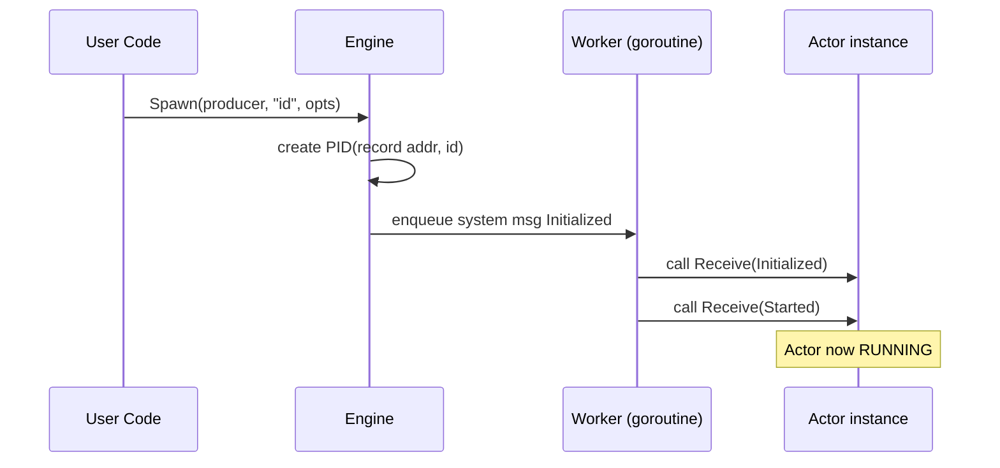

# hollywood

> https://github.com/catwithtudou/hollywood

Hollywood is an ULTRA fast actor engine build for speed and low-latency applications. Think about game servers,
advertising brokers, trading engines, etc... It can handle **10 million messages in under 1 second**.

> 注释 repo 分支：[learn/detail](https://github.com/catwithtudou/hollywood/tree/learn/code_detail)


## 1. 整体设计与架构

```
┌───────────────────────────────────────────────────────────┐
│                        Your App                          │
├───────────────────────────────────────────────────────────┤
│                  Hollywood Public API                    │
│  (Engine.Spawn / Engine.Send / Context.Receive / Remote) │
├───────────────────────────────────────────────────────────┤
│ Engine(调度栈) ─ Actor(业务逻辑) ─ Inbox(环形缓冲区)       │
│ │                                                     │  │
│ │  Local Dispatcher      Remote Dispatcher            │  │
│ │  (goroutine pool)      (dRPC client/server)         │  │
├─┼──────────────────────────────────────────────────────────┤
│           Crash Buffer / Supervision / Eventstream        │
├─┼──────────────────────────────────────────────────────────┤
│ Cluster (Discovery + Activation + Sharding)               │
├─┼──────────────────────────────────────────────────────────┤
│ RingBuffer / SafeMap / Proto-codegen（零反射）            │
└─┴──────────────────────────────────────────────────────────┘
```

1. **Engine** –「单节点运行时」
   * 负责 Actor 生命周期、消息调度、异常恢复、度量采集。
   * 每个 Engine 启动后会起一组固定 Worker goroutine 做消息派发。

2. **Messaging 层**
   * **Local**：生产者直接把消息 push 进目标 Actor 的 Inbox（环形缓冲区），无需锁。
   * **Remote**：若目标 PID 对应的 Node 不是本地，消息会交给 `remote.Dispatcher`，通过 dRPC 传输。反序列化后仍旧进入 Inbox。

3. **Cluster 层**（可选）
   * 抽象一个统一的 `cluster.PIDCache`，解决「我要给谁发」的问题。
   * 借助 Gossip 维护成员状态，按 Shard 进行 Actor Activation/Deactivation，实现天然水平扩容。

4. **可靠性层**
   * **Crash Buffer**：Actor 崩溃后 Inbox 里未确认的 offset 会被 Engine 暂存，待重启后回放。
   * **Supervision Tree**：父 Actor 监督子 Actor，策略：`OneForOne`（默认）+ 最大重启次数。
   * **Eventstream**：系统级事件（DeadLetter、Restart、RemoteUnreachable、Cluster Events）统一发布到流。

5. **工具 & 配套**
   * Middleware、WASM 支持、Benchmark、可 pluggable Logger（基于 slog）。

---

## 2. 代码组织结构


```
hollywood/
├── actor/               # 核心运行时 (≈ 2 300 LOC)
│   ├── engine.go        # 单节点调度中心，负责 Spawn / Send / Supervision
│   ├── pid.go           # 进程标识 PID，提供 Equal / String / Marshal
│   ├── context.go       # 注入 Message、Sender、Engine helpers 给 Receive()
│   ├── options.go       # EngineOpt & SpawnOpt 的函数式配置
│   ├── inbox.go         # 每个 Actor 的 RingBuffer 包装层
│   ├── inbox_test.go
│   ├── middleware.go    # Middleware 链式实现 + 默认 Tracing/Logging MW
│   ├── system.go        # 系统消息类型：Initialized/Started/…/Restarted
│   ├── crashbuf.go      # Crash Buffer 及回放逻辑
│   ├── supervisor.go    # One-For-One 重启计数 & Backoff 计算
│   ├── receiver.go      # `Receiver` 接口与 `SpawnFunc` 语法糖
│   ├── stats.go         # Engine 运行指标结构体
│   └── internal/        # 仅 actor 包可见的实现细节
│       ├── worker.go    # Worker goroutine 主循环
│       └── scheduler.go # 任务分配 & work-stealing
│
├── remote/              # 远程通信栈 (≈ 1 100 LOC)
│   ├── remote.go        # Remote 对象入口，保持到 Engine 的引用
│   ├── client.go        # dRPC 客户端；封装 Send() / ConnPool
│   ├── server.go        # dRPC 服务端；listener + frame decode
│   ├── dispatcher.go    # 本地→远程的路由决策
│   ├── conn_pool.go     # 多路长连池，支持 TLS & 连接探活
│   ├── codec/           # Protobuf 编/解码抽象
│   │   ├── codec.go
│   │   └── registry.go  # typeID ↔ reflect.Type 注册表
│   ├── proto/           # .proto 文件 + 生成的 *.pb.go
│   └── types.go         # 对外公开的 Remote Config、Error 定义
│
├── cluster/             # 全局 Actor 发现 & Sharding (≈ 900 LOC)
│   ├── cluster.go       # 对外 API：Start / Shutdown / Activate
│   ├── memberlist.go    # 基于 Gossip 的节点探测
│   ├── shard.go         # 分片映射 MurmurHash + 冷/热迁移
│   ├── activation.go    # Activate / Deactivate RPC 协议
│   ├── events.go        # Cluster.*Event 定义
│   └── config.go        # 调参入口：shard 数、心跳、闲置 TTL
│
├── ringbuffer/          # Lock-Free MPSC 队列 (≈ 300 LOC)
│   ├── ring.go          # 真·核心：mask/pos/head/cursor
│   └── ring_test.go
│
├── safemap/             # 高并发 Map 替代品 (≈ 120 LOC)
│   ├── map.go           # 分段锁实现；热 path 无反射
│   └── map_test.go
│
├── examples/            # 每个子目录都是一个可运行示例
│   ├── hello/
│   ├── request/
│   ├── eventstream/
│   ├── middleware/
│   ├── remote/
│   └── cluster/
│
├── _bench/              # 官方基准测试脚本
│   ├── benchmark_test.go
│   └── flamegraph.sh    # pprof → SVG 自动化
│
├── .github/workflows/   # CI：Lint、Test、WASM build matrix
├── Makefile             # 常用命令：make test / bench / wasm
├── go.mod / go.sum
└── README.md            # 文档首页
```

---

### 重点文件解读

#### 1. `actor/engine.go`（≈ 650 LOC）

核心入口函数：
```go
func NewEngine(cfg *EngineConfig) (*Engine, error) {
    e := &Engine{
        sysInbox: ringbuffer.New(1024),
        workers:  make([]*worker, cfg.numWorkers),
        ...
    }
    go e.startSystemLoop()
    return e, nil
}
```
* `startSystemLoop` 负责 dispatch 系统事件、定时任务（如 CrashBuffer 回放）。
* `Engine.Send`：先查本地 `pid.locator`; miss → Remote dispatcher。
* `spawn()` 内部会：
  1. 创建 Inbox
  2. 把 `Initialized`、`Started` 系统消息预写进 Inbox
  3. 把 PID 映射到 `safeMap`

#### 2. `remote/dispatcher.go`

```go
func (r *Remote) Tell(p *actor.PID, env *actor.Envelope) error {
    if p.NodeID == r.selfID {
        return r.engine.PushLocal(p, env)
    }
    return r.clients.Send(p.NodeID, env) // dRPC
}
```
* 简单两行代码决定 **本地热路径** 与 **跨节点路径**，便于阅读与调优。

#### 3. `cluster/shard.go`

* `rebalance()` 在检测到 `MemberLeaveEvent` 时触发：
  1. 重新计算 Hash → Bucket
  2. 对迁出的 Shard 发送 `DeactivateReq`
  3. 对迁入的 Shard 调 `ActivateReq`

高并发时期，通过 `sync/atomic.Value` 持有不可变 `map[shardID]nodeAddr`，避免读锁开销。

---

### 建议阅读顺序

1. `ringbuffer/ring.go` —— 数据结构基石
2. `actor/inbox.go`    —— 如何封装 RingBuffer
3. `actor/engine.go`   —— 调度管线、异常处理
4. `remote/client.go` / `server.go` —— 跨节点消息的生命周期
5. `cluster/activation.go` —— 全局 Actor 激活协议


## 3. 运行时工作流程（完整时序）

### 3.1 Actor 创建



*Producer* 可以是：
- `func() actor.Receiver`（带状态）
- `actor.SpawnFunc`（无状态闭包）

### 3.2 本地消息发送

```
User/Actor goroutine
    ↓ Push
RingBuffer(Inbox, 无锁)
    ↓ Pop by Worker
Worker goroutine pool
    → 调用 target.Receive(ctx)
```

- `Inbox` 队列长度由 `WithInboxSize` 决定，写满后 `Send` 会阻塞（可做背压）。

### 3.3 远程消息发送

```
Send(pid) -> Engine -> remote.Dispatcher
    -> pick dRPC connection（ConnPool）
    -> protobuf 编码 -> TLS(optional)
    -> Remote Node -> server.decode
    -> Routed to local Engine -> Inbox
```

连接复用，支持 *pipelining*，减少 RTT。

### 3.4 异常 & 重启

1. `Receive()` 中 panic
2. Worker 捕获，记录 stack，Inbox 未消费 offset 进入 **Crash Buffer**
3. 若未超过 `maxRestarts`：
   - 新建 Actor 实例
   - 发送 `Restarted` 系统消息
   - 把 Crash Buffer 消息按原顺序 replay

否则 `Stopped`，消息进入 DeadLetter。

### 3.5 Eventstream 分发

```
EventProducer (Engine/Cluster)
    -> eventstream.publish(evt)
Subscribers (Actor/Logger)
    -> Receive(ctx) with evt
```

按主题/类型订阅，当前实现是「全局广播 + 本地过滤」。

---

## 4. 关键技术亮点

Hollywood 的底层实现遵循一个核心哲学：

> “把复杂度压缩进运行时，而不是留给业务”。

锁-Free 数据结构、无反射序列化、可回放的 Crash Buffer、自动分片集群——这些技术细节共同支撑了它“百万级消息 / sub-ms 延迟”的指标。希望以上拆解能让你在阅读源码时“对号入座”，快速完成 **从使用者 → 维护者 → Hacker** 的角色跃迁。

### 4.1 Lock-Free RingBuffer（`ringbuffer/ring.go`）

**1. 数据结构**

```go
type Ring struct {
  mask   uint64        // 容量 - 1，容量必须为 2^n
  cursor uint64        // 最后一次成功写入的槽位
  head   uint64        // 消费位置，仅由单一 Consumer 读写
  buf    []atomic.Value
}
```

* **mask**：位运算取模，比 `%` 要快 1-2 ns。
* **cursor / head**：使用 `atomic.*Uint64`，配合 Go 的 **release-acquire** 语义确保有序可见性。
* **单消费者**：Actor 的 Inbox 只被自己消费，省去 CAS；写侧可并发。

**1.2 写入算法（MPSC）**

```go
func (r *Ring) Enqueue(v any) bool {
  for {
    pos := atomic.LoadUint64(&r.cursor) + 1        // slot we WANT
    if pos - atomic.LoadUint64(&r.head) > r.mask { // 队列已满
        runtime.Gosched()
        continue // backoff
    }
    if atomic.CompareAndSwapUint64(&r.cursor, pos-1, pos) {
        r.buf[pos & r.mask].Store(v)               // release 写
        return true
    }
  }
}
```

* **写满**：写侧自旋 + `Gosched`，制造背压而不是丢弃。
* **假溢出**：`pos - head` 使用 **无符号溢出** 规避 wrap-around 判断。

**1.3 读取算法（SPMC→SPSC）**

```go
func (r *Ring) Dequeue() (any, bool) {
  head := r.head + 1
  if head > atomic.LoadUint64(&r.cursor) {
      return nil, false // empty
  }
  v := r.buf[head & r.mask].Load() // acquire
  r.head = head                    // 单消费者，非原子
  return v, true
}
```

读侧不需要任何 CAS / 原子写，是极限优化路径；GC 通过 `atomic.Value` 自动处理 Escape。

---

### 4.2 Inbox（`actor/inbox.go`）

* **每个 Actor 一个 RingBuffer**，Inbox 长度可在 `Spawn` 时通过 `WithInboxSize` 指定。
* 发送路径仅分配 **1 次**：发送者持有的 `envelope{sender, msg}`。
* 当 `Enqueue` 返回 `false` 时，`Engine.Send` 会阻塞 `select { case <-time.After(backoff) ... }`，确保系统稳定而非狂暴堆积。

---

### 4.3 dRPC 远程通信栈（`remote/*`）

> 为什么不是 gRPC？
> – gRPC 反射 & HTTP/2 层抽象“太重”，且生成的代码分配多。dRPC 是 Google 开源的“精简版”，零反射、接口更贴近 net.Conn。

**1. 数据包格式**

```
+-------------+---------+---------------+
| 1B Magic(0) | 4B Len  |  N  Payload   |
+-------------+---------+---------------+
```

* **Magic=0**：方便后续版本扩展。
* **Payload**：`proto.ActorEnvelope`，字段仅 `sender`, `target`, `bytes message`.

**2. 流程**

a. **ConnPool**：每个 `(localAddr → remoteAddr)` 维护固定数量连接（默认为 CPU 核数）。
b. **Send**：Codec.Protobuf → `pool.pick().WriteFrame()` → 远端 demux。
c. **Server**：事件循环读 Frame，解包后 `engine.route()`（无反射 dispatch）。
d. **TLS**：`remote.Config.WithTLS(*tls.Config)` 走 `tls.Client/Server` 包装；证书热更新可自行替换 Config pointer。

**3. 零拷贝优化**

* `payload` 使用 `proto.MarshalOptions{AllowPartial: true, UseCachedSize: true}`
* dRPC Frame 写时利用 `io.Writer` 接口的 `ReadFrom`：避免双重缓冲。

---

### 4.4 Protobuf 无反射编码（`remote/codec` + `*.pb.go`）

* 通过 **`google.golang.org/protobuf` + `protoc-gen-go --experimental_allow_proto3_optional`**。
* 所有业务消息都要求 **指针类型**，空接口解包后再做类型断言。
* 若消息仅本地使用，可以是任何类型；跨进程必须在 `codec` 注册：

```go
func init() {
  codec.Register(&myproto.Chat{}, 42) // 42 == msgTypeID
}
```

`Register` 会生成一个 `typeID → reflect.Type` map，仅初始化时使用一次，运行时不走反射。

---

## 4.5 Crash Buffer（`actor/crashbuffer.go`）

```
┌─────panic─────┐
│ Receive()     │
└───▲────┬──────┘
    │save│
┌───┴────┴──────────────────┐
│ entries: []envelope, head │
└───────────────────────────┘
```

1. Worker `defer` 捕获 panic，记录 stack（`debug.Stack()`）。
2. 计算 **未消费区间**：`inbox.head .. inbox.cursor`，拷贝到 CrashBuffer。
3. 如果 `restartCount ≤ maxRestarts`：
   * 重新实例化 Receiver
   * 系统注入 `Restarted`
   * 将 CrashBuffer 顺序 `engine.pushReplay()` —— **重放不经过网络层**。
4. 若超阈值 → `Stopped` + 全部消息发到 **DeadLetterQueue**，并通过 Eventstream 广播。

---

## 4.6 Supervision Tree

* 默认 **One-For-One**：子 Actor 崩溃只重启自己。
* `WithMaxRestarts(n)` + **指数退避**：`1s, 2s, 4s … 2^n`。
* 未来 roadmap：支持 `All-For-One`, `RestForOne` 策略，Issue #152。

---

## 4.7 Cluster Sharding（`cluster/shard.go`）

**1. 分片算法**

```go
shardID := murmur3.Sum32(id) % numShards
bucket   := shardMap[shardID] // bucket = nodeAddr
```

* **Murmur3**：CPU Cache 友好、分布均匀。
* **numShards** 默认 256，可在 `cluster.Config` 调整；值越大 → 迁移粒度越小。

**2. 激活生命周期**

- `engine.Spawn` 发现自己不在 bucket → 走 remote 激活请求。
- 目标节点接收 `ActivationReq`，如果本地无实例则 **懒惰创建**，否则返回现有 PID。
- `Deactivation`：Actor长时间 idle（`passivationTTL`）由定时任务调度到磁盘并删除 PID Map。

**3. 失联处理**

* 心跳 1 s，连续 3 次丢包 → `RemoteUnreachableEvent`
* shard 由存活节点抢占重分配，应用侧无需感知。

---

### 4.8 WebAssembly / JS Runtime

* 依赖 Go ≥ 1.22 的 **`wasip1`** ABI。
* Engine 会自动探测 `GOARCH=wasm`，把 Worker 数量锁为 **1**（浏览器 JS 线程不支持线程并行）。
* 网络层目前仅支持 `fetch()` over HTTP；dRPC over WebSocket 仍在 roadmap。
* 二进制示例：`make wasm-chat` → 1.4 MB gzipped。

---

### 4.9 Middleware 设计

```go
type Middleware func(next actor.ReceiveFunc) actor.ReceiveFunc
```

* 纯函数链式包装，零反射、零 interface{} 强转。
* 尽可能保持 **no-alloc**：示例 Prometheus MW 只在 `Started` 时创建指标，在 handler 中只 `Observe`。

```go
func LatencyMW(hist prometheus.Observer) Middleware {
  return func(next actor.ReceiveFunc) actor.ReceiveFunc {
    return func(ctx *actor.Context) {
      begin := time.Now()
      next(ctx)
      hist.Observe(time.Since(begin).Seconds())
    }
  }
}
```

---

### 4.10 Metrics & Event Hooks

1. **Eventstream**：订阅 `actor.DeadLetterEvent`, `cluster.MemberJoinEvent`，可直接转换为 Prom metrics。
2. **Middleware**：延迟 / inbox 深度。
3. **Engine Stats**：`engine.Stats()` 暴露 `GoMemStats` + 每秒消息吞吐，可挂在 `/debug/vars`。

---

### 4.11 性能“陷阱”与最佳实践

| 场景 | 风险 | 建议 |
|------|------|------|
| 大消息（>64 KB） | 单帧发送可能阻塞 | 配置 `WithMaxFrame 16KB` 并拆包 |
| Actor CPU 饥饿 | Worker 数 < CPU | 设置 `Engine.WithNumWorkers(runtime.NumCPU())` |
| 背压失效 | InboxSize 过大 | 经验值 `≈ 每秒消息量 * 2` |
| GC 抖动 | 高分配的 Receive | 用对象池或预分配 slice |


